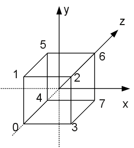
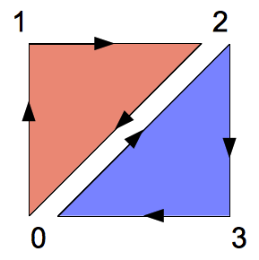
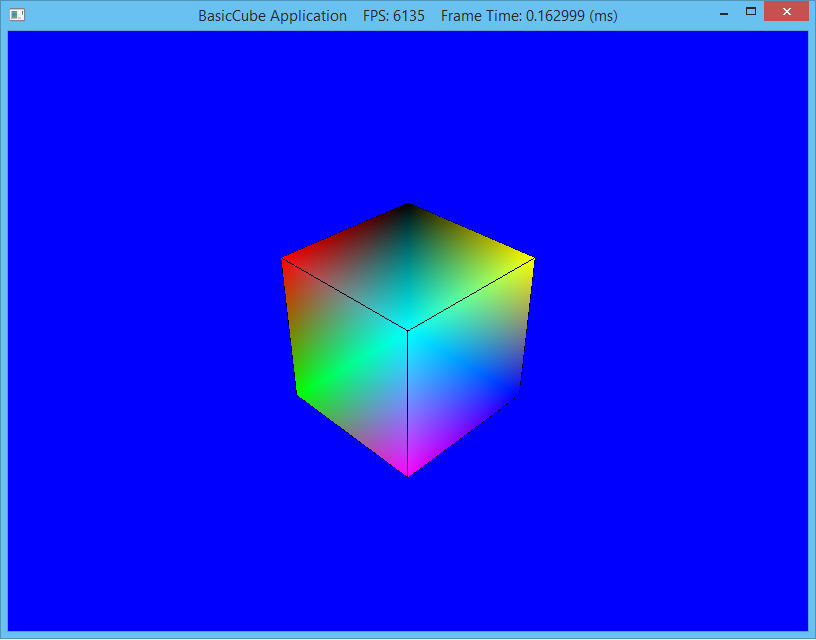

Unlike OpenGL where (at least using GLUT) we had a working application rendering graphics with only a few lines of code, it has taken us three periods to get to the point to even *begin* to render geometry with DirectX 10. Fortunately most of the framework we have developed can serve as the basis for a majority of our programs as it will load shaders and render geometry.

Our application is now ready to render geometry using a shader, so the next step is to create some geometry. Usually a 3D modeling program (such as [3ds Max](http://usa.autodesk.com/adsk/servlet/pc/index?siteID=123112&id=13567410) or [Blender](http://www.blender.org)) is used to create complex object geometries (and apply textures, etc.) which are then loaded into the DirectX application using a *model loader*. Later in this course we will see how to use Blender to create models and use an importer to bring them into our application framework by defining a **Mesh** class. For now we will just create geometry directly in the application (similar to OpenGL) to understand how it is handled.

0. Getting Started
==================

Navigate into the **CS370\_Lab03** directory and double-click on **CS370\_Lab03.sln** (the file with the little Visual Studio icon with the 12 on it) which should immediately open another instance of Visual Studio with the project.

If the **Header Files**, **Resource Files** and **Source Files** folders in the **Solution Explorer** pane are not expanded, expand each by double clicking on them and double-click on **Cube.h** and **Cube.cpp**.

1. Cube Declaration
===================

Double-click **Cube.h** which should have a skeleton structure already in the file with the method prototypes already in place.

At this point we are ready to add the class attributes (variables) in the **private** section. Note that by convention, class attributes begin with **m**. The following set of attributes will store information about the cube object such as the number of vertices, number of faces, and number of edges which will be used when we create the vertex and index buffers (remember them from CS370?). We also store pointers to some COM objects DirectX will use to render the object.

    // Geometry values
    DWORD mNumVertices;
    DWORD mNumFaces;
    DWORD mNumEdges;

    // DirectX objects
    ID3D11Device* md3dDevice;
    ID3D11Buffer* mVertexBuffer;
    ID3D11Buffer* mIndexBuffer;

2. Cube Definition
==================

Double-click **Cube.cpp** which should have a skeleton structure already in the file with stubs for all the methods.

First we need define a structure to describe what information will be stored for each vertex (refer back to the vertex layout section of the application class) which in this case will be a 3D vector for the position and a 4D vector for the color. Later we will extend this structure to contain fields for vertex normals (lighting) and texture coordinates.

    #include "Cube.h"

    // Vertex structure
    struct Vertex {
        D3DXVECTOR3 pos;
        D3DXCOLOR color;
    };

**Constructor**

The constructor just initializes all the attributes to 0.

    // Constructor
    Cube::Cube() : mNumVertices(0),mNumFaces(0),md3dDevice(0),mVertexBuffer(0),mIndexBuffer(0)
    {
    }

**Destructor**

The destructor will need to release the two buffer COM objects we will be initializing.

    // Destructor
    Cube::~Cube()
    {
        ReleaseCOM(mVertexBuffer);
        ReleaseCOM(mIndexBuffer);
    }

**Initialization**

The **Init()** method will do most of the heavy lifting in terms of defining a vertex array with the coordinates of the vertices and assigning a color to them, creating an index array to specify which vertices belong to which polygon (remember we are using *triangle list* primative topology), and then create the corresponding vertex and index buffers using these arrays.

We will want to add edges to our cube faces, since they are a different color we need 16 vertices - the first 8 for the faces (colored) and the last 8 for the edges (black). There will be two triangles needed to draw each (square) face, so we need 12 faces (which will be defined in the index array). Finally since each of the 6 faces has 4 edges there will be a total of 24 edges.

    // Set instance attributes (2 triangles per face)
    md3dDevice = device;
    mNumVertices = 16;
    mNumFaces = 12;
    mNumEdges = 24;

Remembering that DirectX utilizes a *left-handed* coordinate system, we can list the vertices of the cube according to the following picture:

> 

    // Create vertex array
    Vertex vertices[] = 
    {
        // face vertices
        {D3DXVECTOR3(-1.0f,-1.0f,-1.0f),WHITE},
        {D3DXVECTOR3(-1.0f,1.0f,-1.0f),BLACK},
        {D3DXVECTOR3(1.0f,1.0f,-1.0f),RED},
        {D3DXVECTOR3(1.0f,-1.0f,-1.0f),GREEN},
        {D3DXVECTOR3(-1.0f,-1.0f,1.0f),BLUE},
        {D3DXVECTOR3(-1.0f,1.0f,1.0f),YELLOW},
        {D3DXVECTOR3(1.0f,1.0f,1.0f),CYAN},
        {D3DXVECTOR3(1.0f,-1.0f,1.0f),MAGENTA},
        // edge vertices
        {D3DXVECTOR3(-1.0f,-1.0f,-1.0f),BLACK},
        {D3DXVECTOR3(-1.0f,1.0f,-1.0f),BLACK},
        {D3DXVECTOR3(1.0f,1.0f,-1.0f),BLACK},
        {D3DXVECTOR3(1.0f,-1.0f,-1.0f),BLACK},
        {D3DXVECTOR3(-1.0f,-1.0f,1.0f),BLACK},
        {D3DXVECTOR3(-1.0f,1.0f,1.0f),BLACK},
        {D3DXVECTOR3(1.0f,1.0f,1.0f),BLACK},
        {D3DXVECTOR3(1.0f,-1.0f,1.0f),BLACK}
    };

Since we are using a *triangle list* to draw the faces, we need to observe the *left-hand* rule to order our vertices to ensure the correct outward facing normal (i.e. the front face). For example the front face (the one at z = -1) could be divided up into two triangles with vertices (0,1,2) [red] and (0,2,3) [blue] as shown below

> 

When we draw, we are able to specify which vertex to start with. This allows us to begin indexing at 0 for *each separate object* in the vertex array (although we can always simply continue the index numbering). This is often very convenient when we have several objects (and index arrays) created separately that we wish to combine into single vertex/index arrays since we do not need to renumber the indices for subsequent objects. Hence the index array can be constructed as follows

    // Create index array
    DWORD indices[] = 
    {
        // Front face
        0,1,2,
        0,2,3,
        // Back face
        4,6,5,
        4,7,6,
        // Left face
        4,5,1,
        4,1,0,
        // Right face
        3,2,6,
        3,6,7,
        // Top face
        1,5,6,
        1,6,2,
        // Bottom face
        4,0,3,
        4,3,7,
        // Front edges
        0,1,2,3,0,
        // Back edges
        4,5,6,7,4,
        // Left edges
        4,5,1,0,4,
        // Right edges
        3,2,6,7,3,
        // Top edges
        1,5,6,2,1,
        // Bottom edges
        4,0,3,7,4
    };

We now create the vertex buffer (similar to our other COM objects) by initializing the fields of a descriptor variable including the total size of the vertex array and the type of buffer the data should be used for. We then create a resource variable and set its data field to our vertex array.

    // Create vertex buffer
    D3D11_BUFFER_DESC vbd;
    vbd.Usage = D3D11_USAGE_IMMUTABLE;
    vbd.ByteWidth = sizeof(Vertex)*mNumVertices;
    vbd.BindFlags = D3D11_BIND_VERTEX_BUFFER;
    vbd.CPUAccessFlags = 0;
    vbd.MiscFlags = 0;
    vbd.StructureByteStride = 0;
    D3D11_SUBRESOURCE_DATA vinitData;
    vinitData.pSysMem = vertices;

    HR(md3dDevice->CreateBuffer(&vbd, &vinitData, &mVertexBuffer));

Similarly we create the index buffer using our index array (note the calculation used for the total number of indices, particularly the number of edges where each edge loop has one extra vertex to complete the loop)

    // Create index buffer
    D3D11_BUFFER_DESC ibd;
    ibd.Usage = D3D11_USAGE_IMMUTABLE;
    ibd.ByteWidth = sizeof(DWORD)*(mNumFaces * 3 + (mNumEdges + 6));
    ibd.BindFlags = D3D11_BIND_INDEX_BUFFER;
    ibd.CPUAccessFlags = 0;
    ibd.MiscFlags = 0;
    ibd.StructureByteStride = 0;
    D3D11_SUBRESOURCE_DATA iinitData;
    iinitData.pSysMem = indices;

    HR(md3dDevice->CreateBuffer(&ibd, &iinitData, &mIndexBuffer));

**Draw**

At last the **Draw()** method can render the geometry stored in the vertex and index buffers through the immediate context of the device. To do this we need to tell DirectX where to start in the vertex buffer (i.e. we can store several different objects in a single vertex buffer as we are doing with the faces and edges) and how far to step (i.e. *stride*) based on the size of the vertex structure. We then simply set the topology (to be sure it is correct for *this* object) and tell DirectX to draw using indexed mode by passing how many indices to render, which index to start at, and where in the vertex buffer to start (remember that we indexed the edges *starting* at the middle vertex in the array).

    // Step by Vertex size
    UINT stride = sizeof(Vertex);

    // Start at beginning of buffer
    UINT offset = 0;

    // Set buffers for device
    immediateContext->IASetVertexBuffers(0, 1, &mVertexBuffer, &stride, &offset);
    immediateContext->IASetIndexBuffer(mIndexBuffer, DXGI_FORMAT_R32_UINT, 0);

    // Draw faces
    immediateContext->IASetPrimitiveTopology(D3D10_PRIMITIVE_TOPOLOGY_TRIANGLELIST);
    immediateContext->DrawIndexed(mNumFaces * 3, 0, 0);

    // Draw edges
    immediateContext->IASetPrimitiveTopology(D3D10_PRIMITIVE_TOPOLOGY_LINESTRIP);
    immediateContext->DrawIndexed((mNumEdges + 6), mNumFaces * 3, mNumVertices / 2);

3. Shader (Effects) File
========================

DirectX 11 (and the recent version of OpenGL) forego the default graphics pipeline architecture relying instead completely on programmable shaders - known as *effects* - to render geometry. DirectX shaders are comprised of at least one vertex and one pixel shader that are combined into a *technique*. An effects file may contain multiple different shaders (including an additional *geometry shader*) that can be assembled in different combinations to create multiple techniques (that are selected in the application as desired).

Just like GLSL, HLSL (the DirectX shader language) associates pointers in the application with variables in the shader and then sets values for these variables through the application pointer (refer back to the last part of the **buildFX()** method definition in the previous lab).

We will add the effects file into **Resource Files**. Create a new text file (right click the **Resource Files** folder and select **Add-\>New Item...** making sure to choose **Utility** and **Text File (.txt)**) named **basiccube.fx**.

We now need to adjust the properties of **basiccube.fx** by right clicking on it and selecting **Properties**. Under **HLSL Compiler-\>General** change **Shader Type** to **Effect (/fx)** and **Shader Model** to **Shader Model 5 (/5\_0)** (see the **D3DX11CompileFromFile()** call in **buildFX()** method).

**Shader Variables**

First we will define one global matrix passed from the application which will store the complete world-view-projection matrix (i.e. similar to the **gl\_ModelViewProjectionMatrix** variable from GLSL). This variable will be a constant buffer that will only change on a per object basis.

    // World-View-Projection matrix buffer
    cbuffer cbPerObject
    {
        float4x4 gWVP;
    };

**Vertex Shader**

Since the vertex shader will need to input and output multiple pieces of information (i.e. vertex position and color which must match the vertex layout defined in our **buildVertexLayouts()** method), we will define structs for the input and output vertex component types (note they are not the same).

We will name our vertex shader **VS()** (although any valid C syntax function name may be used) which takes an input vertex struct and will output the transformed vertex struct. The vertex transformation calculation will simply multiply the (homogeneous) vertex coordinates by the (shader) world-view-projection matrix. Finally the vertex shader will just pass the color down the pipeline unchanged.

    // Input vertex datatype
    struct VIn
    {
        float3 inPos : POSITION,
        float4 inCol : COLOR
    };

    // Output vertex datatype
    struct VOut
    {
        float4 pos : SV_POSITION
        float4 col : COLOR
    };

    // Vertex shader
    VOut VS(VIn vin)
    {
        VOut vout;

        // Apply world-view-projection transformation
        vout.pos = mul(float4(vin.inPos, 1.0f), gWVP);

        // Pass color through
        vout.col = vin.inCol;
    }

**Pixel Shader**

Pixel shaders only return one value of type **float4** named **SV\_TARGET** which is the color to set the fragment in the render target. Since we do not have a geometry shader, the *input* datatype of the pixel shader will match the *output* datatype of the vertex shader.

We will name our pixel shader **PS()**, but again any valid C function name is allowed. This pixel shader will simply set the final fragment color to the one passed by the vertex shader (in the future we will apply lighting and textures here).

    // Pixel shader
    float4 PS(VOut pin) : SV_Target
    {
        // Simply set color
        return pin.col;
    }

**Technique Description**

Lastly, we need to tell DirectX which vertex and pixel (and possibly geometry) shaders to combine to create all the techniques we wish to use. Each technique is given a unique name (which is referenced by the application, recall **buildFX()** from the last lab). Techniques may also have multiple *passes* which can be used for multipass rendering techniques.

We will name the technique **BasicTech** and use our previously defined vertex (**VS()**) and pixel (**PS()**) shaders.

    // Technique
    technique10 BasicTech
    {
        pass P0
        {
            SetVertexShader(CompileShader(vs_5_0,VS()));
            SetGeometryShader(NULL);
            SetPixelShader(CompileShader(ps_5_0,PS()));
        }
    }

4. Compiling and running the program
====================================

Once you have completed typing in the code, you can build and run the program in one of two ways:

> -   Click the small green arrow in the middle of the top toolbar
> -   Hit **F5** (or **Ctrl-F5**)

The output should look similar to below

> 

To quit the program simply close the window.

Now that we have a functional program to render geometry, we need to add all the effects that we had from CS370 including lighting and texture mapping. These effects will require us to expand our vertex structure to include information about the normals and texture coordinates, pass additional information into the shaders, and finally add functionality into the shaders to apply these effects to our primatives. Eventually we will also start importing more complex geometry from external modeling programs.

