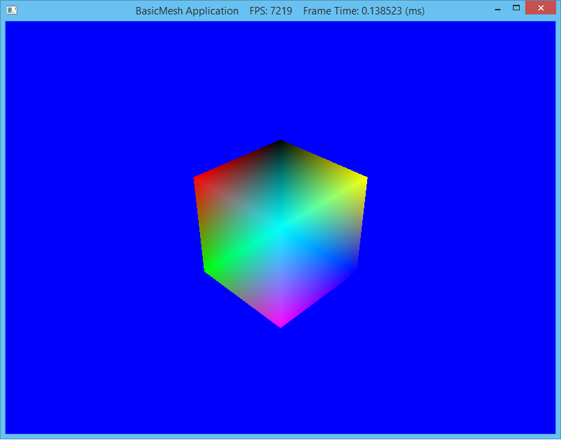

Last lab we created geometry by hand which was cumbersome to say the least. Usually a 3D modeling program (such as [Blender](http://www.blender.org)) is used to create complex object geometries (and apply textures, etc.) which are then loaded into the DirectX application using a *model loader*. The loader will import the geometry into a **Mesh** class object which we can then render. This lab will create a basic mesh framework that will import vertex positions and colors (subsequent labs will extend this class to include materials and textures). Note we will be using Luna's .m3d file format which is not a format generated by standard modelling programs but rather is simple to parse to understand how the various pieces of a model are used. Ultimately we would want to use a more sophisticated model loader and/or write a converter from a standard format (such as .obj) to Luna's format.

0. Getting Started
==================

Download [CS470\_Lab05.zip](src/CS470_Lab05.zip), saving it into the **labs** directory.

Double-click on **CS470\_Lab05.zip** and extract the contents of the archive into a subdirectory called **CS470\_Lab05**. Place this subdirectory into the **Documents/Visual Studio 2013/Projects** directory.

Navigate into the **CS470\_Lab05** directory and double-click on **CS470\_Lab05.sln** (the file with the little Visual Studio icon with the 12 on it) which should immediately open Visual Studio with the project.

If the **Header Files**, **Resource Files** and **Source Files** folders in the **Solution Explorer** pane are not expanded, expand each by double clicking on them and double-click on **M3DMesh.h**, **M3DMesh.cpp**, **BasicMeshApp.h** and **BasicMeshApp.cpp**.

The **Vertex.h** file contains declarations for the vertex structure (similar to the one in the **Cube** class from last lab) as well as the matching layout description.

    struct MeshVertex {
        D3DXVECTOR3 pos;
        D3DXCOLOR color;
    };

1. M3DMesh Declaration
======================

Double-click **Mesh.h** which should have a skeleton structure already in the file with the method prototypes already in place.

We will first add the class attributes (variables) in the **public** section. The first attributes are simply local copies of the mesh data for manipulation by the application. Often mesh objects contain multiple subsets of data which define sections of the mesh that use different materials (although for now we will only use a single material, i.e. colors, for the entire mesh). We also have a **MeshGeometry** attribute which will handle the creation of the various DirectX buffers and render the object. Lastly we will store a local transformation matrix for the object.

    // Local Mesh data copies
    std::vector<MeshVertex> Vertices;
    std::vector<USHORT> Indices;
    std::vector<MeshGeometry::Subset> Subsets;

    UINT SubsetCount;

    // Mesh geometry and local instance transformation
    MeshGeometry MeshData;
    XMFLOAT4X4 World;

2. Mesh Definition
==================

Double-click **M3DMesh.cpp** which should have a skeleton structure already in the file with stubs for some of the methods. The first three methods are standard constructor/destructor methods.

**Initialization**

This method will create the mesh object by loading the data from the specified file which will parse the **.m3d** file format *as defined by Luna* (note: this is **not** a standard 3D model format). Then the method will use the **MeshGeometry** object to create the necessary vertex and index buffers from the data.

    loadM3DMesh(modelFilename);

    MeshData.SetVertices(device, &Vertices[0], Vertices.size());
    MeshData.SetIndices(device, &Indices[0], Indices.size());
    MeshData.SetSubsetTable(Subsets);

    // Store number of subsets for rendering
    SubsetCount = SubSets.size();

**Reading .m3d Files**

Parsing the (basic) .m3d file format is straightforward as the file contains header information followed by three sections for the subset table, vertex data, and index data. Recall that all the geometry will be constructed from triangles.

    // Open .m3d mesh file
    std::ifstream fin(modelFilename);

    if (fin)
    {
        fin >> ignore;                 // ignore file header text
        fin >> ignore >> numVertices;  // read number of vertices
        fin >> ignore >> numTriangles; // read number of triangles

        // Read mesh data
        ReadSubsetTable(fin, 1); // only one material for now
        ReadVertices(fin, numVertices);
        ReadTriangles(fin, numTriangles);

        return true;
    }

The individual section methods are likewise straightforward as they begin with a header line followed by entries for the data that we parse into individual items in the corresponding data vectors.

First we read the subset data which defines which vertex and index blocks each material will use (since we only have a single material, there will only be one subset containing all the vertices and indices).

    // Read subset table
    fin >> ignore; // ignore subset header text

    // Read subset data
    for (UINT i = 0; i < numSubsets; ++i)
    {
        fin >> ignore >> Subsets[i].Id;
        fin >> ignore >> Subsets[i].VertexStart;
        fin >> ignore >> Subsets[i].VertexCount;
        fin >> ignore >> Subsets[i].FaceStart;
        fin >> ignore >> Subsets[i].FaceCount;
    }

The .m3d file then contains a list of all the vertices for the entire object. Again the section simply begins with a header followed by lines containing the position coordinates and the color channels.

    fin >> ignore; // ignore vertices header text

    // Read vertex data
    for (UINT i = 0; i < numVertices; ++i)
    {
        fin >> ignore >> Vertices[i].pos.x >> Vertices[i].pos.y >> Vertices[i].pos.z;
        fin >> ignore >> Vertices[i].color.x >> Vertices[i].color.y >> Vertices[i].color.z >> Vertices[i].color.w;
    }

Once all the data is loaded, the various methods for the **MeshGeometry** object are called to create the corresponding buffers similar to how they were created in the last lab.

**Draw**

Drawing is handled by the **MeshGeometry** class by again setting the appropriate buffers, telling DirectX what type of primatives to use (triangles), and then rendering an entire subset which for now is the entire object.

3. BasicMeshApp Definition
==========================

Again our application will be a subclass of **D3DApp** similar to previous labs. This time we will add a class attribute for our mesh object (and corresponding filename).

    // Cube mesh object
    M3DMesh mBox;
    std::string mMeshFileName;

4. BasicMeshApp Declaration
===========================

In our application class source **BasicMeshApp.cpp**, we will add the mesh filename to the constructor

    mMeshFileName = "cube.m3d";

Then we just need to add initialization in the **Init()** method *after loading the shader* via the base class **Init()**.

    // Call cube object initialization
    mBox.Init(md3dDevice,mMeshFileName);

Finally in **DrawScene()** we simply need to draw the mesh by setting the view-projection matrix and looping over all the subsets.

    // Render object
    // Set modelview projection matrix for object
    XMMATRIX w = XMLoadFloat4x4(&mBox.World);
    XMMATRIX wvp = w*VP;
    mFXMatVar->SetMatrix(reinterpret_cast<float*>(&VP));
    // Draw subsets
    for (UINT subset = 0; subset < mBox.SubsetCount; ++subset)
    {
        mTech->GetPassByIndex(p)->Apply(0, md3dImmediateContext);
        mBox.MeshData.Draw(md3dImmediateContext, subset);
    }

4. Compiling and running the program
====================================

Once you have completed typing in the code, you can build and run the program in one of two ways:

> -   Click the small green arrow in the middle of the top toolbar
> -   Hit **F5** (or **Ctrl-F5**)

The output should look similar to below

> 

To quit the program simply close the window.

If we wish to use different vertex layouts and/or shaders *per mesh* we could move **buildFX()** and **buildVertexLayouts()** into the mesh class and then set the layout each time every mesh is rendered. However, since eventually we will be using a standard mesh format which will include lighting and texture fields, it will be more efficient to set it once in the application and then simply render all the meshes with the same layout.

While the mesh model format is marginally easier to use than creating geometry natively in a class, it would still be extremely cumbersome for even moderately complex geometry. Fortunately most 3D modeling programs can export the models to a standard DirectX format (.x). While DXUT includes a loader for this format, standard DirectX does not.

