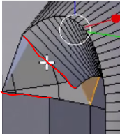

We now know how tedious creating our own geometry can be, so why not pass the work off to a 3D modeling program such as Blender? 

0. Getting Started
==================

If you have not already done so, download [blender](http://www.blender.org/download/).

Open the program.

The default Blender new file includes: 1 camera, 1 light source, and 1 cube.

Inorder to delete these objects you must first select them. In order to select an object simply click it with your right mouse button. To deselect an object press the 'a' key. This key can also be used to select everything in a scene.

To delete all the object in a scene press 'a' (all objects should be highlighted in orange), then press the 'del' key. You will be asked to confirm the delete. 

To rotate the entire screen, hold down the middle mouse button and move your mouse. 

To change your camera position(pan) hold down shift and the middle mouse button while moving your mouse. 

To zoom in or out, use the mouse wheel. 

To change your view (Top, left front...etc) use the number on your side number pad. Or use the **View** menu on the bottom of the screen. 

Press 5 on your number pad to toggle between Perspective and Orthogonal modes. 

1. Modeling a Simple Coffee Cup
===============================

*This simple introdcution is based on a tutorial "Blender Tutorial For Beginners: Coffee Cup" by Youtube user tutor4u. Check his channel out for more easy to follow Blender tutorials.*  

Basic Setup
----------- 

-   To start, select Cycles Render from the drop down menu at the top of the screen.
 
	> 

-   To add your starting object, you may either use the **Create** sub menu on the side of the screen or press shift+'a'. Open an add menu and select the cylinder from the mesh submenu to add it to your scene. On the bottom of your left toolbar, an **Add Cylinder** menu should have appeared. 

-   Find the **Cap Fill Type** section and open the drop down menu. Select **Triangle Fan**

-   On the bottom menu find the object interaction menu and switch it from **Object Mode** to **Edit Mode**. (Menu highlighted in yellow below)

	> 

-   Then change the object display menu from **Solid** to **WireFrame**. (Menu indicted by red line. 

2. Let's Make a Cup
===================

To make the cylinder we have look more like a cup, we need to get rid of the top. 

-   Deselct the cylinder (press 'a') and select the top vertices by righting clicking the center point. It should look like this: 

	> 

-   Delete these vertices.

-   Now press '1' on your number pad to toggle the front view and the switch to Ortogonal mode by pressing '5'. 

-   Next we are going to sub divide the cylinder. To do so call the recursive subdive command by pressing ctrl+'r'. Then scroll the mouse wheel up until you have four lines. Then press the left mouse button. 

-   Deselect the cylinder so that we can select only the top vertices. To do so press 'b' on your keyboard and drag the curser so that it encapsulated the top vertices like so:

	> 

-   Move these vertices down about halfway by clicking the blue arrow with the left mouse button and move them down. Then we are going to scale the top by 90%. To do so press 's', type in .9, and press enter. 

-   Deselect then select the middle vertices so that it looks like this:

	> 

-   Then scale these vertices to 105%. 

-   Deselect then select the bottom vertices and scale them to 80%. 

-   Return to **Object Mode** from the object interation menu and switch back to **Solid** in the object display menu.

-   Right now you should have something that looks like this: 

	> 

3. Coffee Cups Look So Much Better With Handles
===============================================

Get the cup out of your way by panning off to the left a little bit. (Use shift and the middle mouse button to pan.) Then move your curser into the empty space and left click.

-   Add a curved path to this space from the **Create** menu.

- While the path is still selected, return to **Edit Mode** from the object interaction menu. You should notice that five points appear on the path. 

We want these nodes to look like a handle. To do so, 

-   Select each node (right mouse button)

-   Move it up or down by left clicking the blue arrow

-   Move it left or right using the red arrow 

You want to make your path (The black line) to form a backwards 'C'. After repositioning the points, your path should look like this: 

> 

We will be connecting the handles around the red dots, so return to **Object Mode**. Now we are going to make our path 3D. To do so we must bevel it using another object.

-   Under the **Create** menu find the circle under the curve menu. While it is still selected scale it down to 20% of its size. 

-   Deselect the circle, then reselect the path. 

-   On the right side of the screen select the **Object Data** menu. 

	> 

-   Find the **Geometry** section and within it find the **Bevel Object** option. Click on the entry box and select the **Bezier Circle**.

Your handle should now appear 3 dimensional. Any changes we apply to the circle will also be applied to he circle. Now we are going to change the resoulion of the circle. 

-   Select the circle and under the **Object Data** menu find the resolution option and change the **Preview** value to one by using the left arrow.

Now we need to convert the handle into a mesh object. To do so:

-   Make sure the handle is selected and press alt+'c'. 

-   A menu will appear. Click on the **Mesh from Curve** option.

Now we may delete the circle. 

4. Reattaching DisConnected Handles
===================================

Now we have a handle created, it's time to attach it.

First we have to make sure the handle is alligned properly. 

-   Press the '7' key on the number pad to switch to top view. The handle should be lined up like this:

	> 

-   Switch back to front view, (Number pad '1'), and move the cup closer to the handle so that there is still a little room between the cup and handle. (Remember: To move the cup select it and use the red arrow.)
 
-   Now we are going to join the object. Make sure the cup is still selected then select the handle by holding shift while clicking it. To join the objects, press ctrl+'j'. 

-   Return to **Edit Mode** from the object interation menu. 

-   Press 'a' to deselect the object. 

-   Then we are going to change our selection mode to **Face** from the selection menu at the bottom of the page. 

	>   

	This allows us to select faces instead of vertices. 

-   Rotate the object so that you are looking down the handle at the cup. (To rotate click middle mouse wheel and move to left). 

-   Delete the faces shown by selecting them and pressing 'del' and selecting faces. 

	>   

-   Rotate the object up and delete the faces shown: 

	>   

Now we are going to connect the handle to the cup. First we must be able to select edges. 

-   Go back to the selection menu at the bottom of the page and press the middle cube from the three shown. This allows us to select individual edges.

-   Rotate back up to the top of the handle. Select the three edges shown by the red marks.

	> 

-   Press the 'f' key on the key board to create a new face between these edges. 

-   Repeat for the next set: 

	> 

-   Rotate under the top of the handle and repeat for these two sets:

	> 

	> 

-   Rotate to the bottom part of the handle and join the following edges: 

	> 

	> 

	> 

	> 

We now have what looks like the outside of a coffee cup!

5. It's What's on the Inside that Counts
========================================

Now that the outside of our cup is looking pretty good, we are going to work on the inside. 

-   Go down to the object display menu and switch to **WireFrame** and press one of the number pad to switch to front view. 

-   Go back to the selection menu at the bottom of the screen and select the first of the three cubes. This allows us to select vertices. 

-   Now select the top section of vertices as we did before when we were making the cup. (Remember the 'b' key is used to select a group of vertices.)

We are going to extrude these vertices. We are only going to extrude the top vertices to the same point. 

-   To extrude press the 'e' key, then press enter to stop extruding. 

-   Then we are going to scale the top vertices to 80%. (To see what the extrude method does, rotate the camera up. Then return to front view)

-   Press the 'e' key to extrude again. 

If you move your mouse you can see what extrude does. We are going to move the vertices down to the first line. 

-   Press the 'z' key to restrict your movement and pull your mouse down so that the points line up with the first line. 

-   Click the left mouse button. Then press 's' and move your mouse to scale so that you have a final product that looks like this:

	> 

-   Then Press the left mouse button to lock the points in.

Now we are going to extrude again and pull the points down to the next line. 

-   Click the left mouse button is scale so that the final product looks like this. 

	> 

-   Then press the left mouse button to lock points in.

-   Repeat this process so that you have this sequence: 

	> 

	> 

-   On the last point extrude again then press enter to extrude to the same point. 

Now we are going to merge all of the new points on the bottom to create a bottom to the cup.  

-   To do this go to the menu on the left. 

-   Be sure that us are in the **Tools** submenu.

-   Scroll down until you find **Merge**. Then select **At Center**. 

Now the inside of the cup is finished.

Return to **Object Mode** and change the object display back to **Solid**.

6. Let's Make it Pretty
=======================

Our cup is looking good and all, but I wouldn't be too proud of it quite yet. In order to make our cup more sightly we are going to smooth out the faces. 

-   Go to the **Tools** menu of the left and find the **Smooth** button underneath **Shading**. 

-   Click the button. 

Your object should look a little less rough. 

-   Now go over to the right side menu and click on the **Object Modifiers** button:

	> 

-   Then click on the **Add Modifer** and select **Subdivision Surface**.

-   Change both the **View** and the **Render** options to 3. The larger the number is here, the smoother the object will be. However, keep the number fairly low to not bog down performance. 

With our cup all smooth, we can add a material to it. 

-   On the Right side menus, select the **Material** menu

	> 

-   Then click the new button. 

Under the **Surface** you can change the color of your cup by editing the color next to the **Diffuse** option.

7. A Cup Worth Sharing
======================

This concludes how to make a cup. Don't forget to save the file by going to **File->Save As**. Next we will find out how to load this model into you program. 