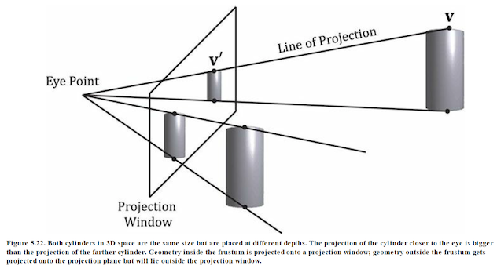
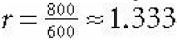

In CS370, we dealt with camera placement that offer two types of projections:  orthogonal and perspective.  Similarly, in CS470 we also have camera placement that offer two viewing modes: orthogonal and perspective.

0. Getting Started
==================

Download [CS470\_Lab07-2.zip](src/CS470_Lab07-2.zip), saving it into the **labs** directory.

Double-click on **CS470\_Lab07.zip** and extract the contents of the archive into a subdirectory called **CS470\_Lab07**

Navigate into the **CS470\_Lab07** directory and double-click on **CS470\_Lab07.sln** (the file with the little Visual Studio icon with the 12 on it) which should immediately open Visual Studio with the project.

If the **Header Files**, **Resource Files** and **Source Files** folders in the **Solution Explorer** pane are not expanded, expand each by double clicking on them and double-click on **Lighting.h**, **Lighting.cpp**, **BasicLightApp.h** and **BasicLightApp.cpp**.

1. View Space 
=============

In order to form a 2D image of the scene, we must place a virtual camera in the scene. The camera specifies what volume of the world the viewer can see and thus what volume of the world we need to generate a 2D image of.

Suppose that we have a local coordinate system called *view space*, *eye space*, or *camera space* attach to a camera. The camera sits at the origin looking down the positive z-axis, the x-axis aims to the right of the camera, and the y-axis aims above the camera.

Instead of describing our scene vertices relative to the world space, it is convenient for later stages of the rendering pipeline to describe them relative to the camera coordinate system. The change of coordinate transformation from world space to view space is called the **view transform**, and the corresponding matrix is called the **view matrix**.

> 

If **Qw = (Qx, Qy, Qz, 1)**, **uw = (ux, uy, uz, 0)**, **vw = (vx, vy, vz, 0)**, and **ww = (wx, wy, wz, 0)** describe, respectively, the origin, x-, y-,
and z-axes of view space with homogeneous coordinates relative to world space, then we know from §3.4.3 that the change of coordinate matrix from view space to world space.  The world coordinate system and view coordinate system generally differ by position and orientation.

The world matrix can be decomposed into a rotation followed by a translation:  **W = RT**.  Below is the inverse computation.

> 

But this isn't exactly what we want.  What we want is the reverse transformation from world space to view space. The reverse transformation is given by W^–1 (inverse W)
Which transforms from world space to view space.

> 

We now show an intuitive way to construct the vectors needed to build the view matrix. 

Let **Q** be the position of the camera and let **T** be the target point the camera is aimed at. Furthermore, let **j** be the unit vector that describes the “up” direction of the world space. (In this book, we use the world xz-plane as our world “ground plane” and the world y-axis describes the “up” direction; therefore, j = (0,1,0) is just a unit vector parallel to the world y-axis.  the direction the camera is looking is given
by:

> 

This vector describes the local z-axis of the camera. A unit vector that aims to the “right” of **w** is given by:

> 

Since **w** and **u** are orthogonal unit vectors, **w × u** is necessarily a unit vector, and so it does not need to be normalized. Therefore, given the position of the camera, the target point, and the world “up” direction, we were able to derive the local coordinate
system of the camera, which can be used to form the **view matrix**.

XNA Math library provides the following function for computing the view matrix based on the just described process:

```cpp
XMMATRIX XMMatrixLookAtLH( // Outputs resulting view matrix V
FXMVECTOR EyePosition, // Input camera position Q
FXMVECTOR FocusPosition, // Input target point T
FXMVECTOR UpDirection); // Input world up vector j
```

Usually the world’s y-axis corresponds to the “up” direction, so the “up” vector is almost always j = (0,1,0). For instance, suppose we want to position the camera at the point (5, 3, −10) relative to the world space, and have the camera look at the origin of
the world (0, 0, 0). We can build the view matrix by writing:

The view matrix will look like this:

```cpp
XMVECTOR pos = XMVectorSet(5, 3, -10, 1.0f);
XMVECTOR target = XMVectorZero();
XMVECTOR up = XMVectorSet(0.0f, 1.0f, 0.0f, 0.0f);
XMMATRIX V = XMMatrixLookAtLH(pos, target, up);
```

2. Camera in 3D Space
=====================

So far we've only dealth with the position and orientation of the camera in the world.  There is another component to the camera:  the volume of space the camera sees. This is also known as the *frustum*.

To project the 3D geometry inside the frustum onto a 2D projection window. The projection must be done in such a way that parallel lines converge to a vanishing point, and as the 3D depth of an object increases, the size of its projection diminishes; a perspective projection does this, and is illustrated in Figure 5.22.

> 

We call the line from a vertex to the eye point the vertex’s line of projection. Then we define the perspective projection transformation as the transformation that transforms a 3D vertex v to the point v´ where its line of projection intersects the 2D projection plane; we say that v´ is the projection of v. The projection of a 3D object refers to the projection of all the vertices that make up the object.

> 

3. Defining a Frustum
=====================

We can define a *frustum* in view space, with center of projection at the origin and looking down the positive z-axis, by the following four quantities:

-   a near plane **n**
-   far plane **f**
-   vertical field of view angle **a**
-   aspect ratio **r**.

Note that in view space, the near plane and far plane are parallel to the xy-plane; thus we simply specify their distance from the origin along the z-axis.

The aspect ratio is defined by **r = w/h** where **w** is the width of the projection window and **h** is the height of the projection window (units in view space).

The projection window is essentially the 2D image of the scene in view space. The image here will eventually be mapped to the back buffer; therefore, we like the ratio of the projection window dimensions to be the same as the ratio of the back buffer dimensions. 

So the ratio of the back buffer dimensions is usually specified as the aspect ratio (it is a ratio so it has no units). For example, if the back buffer dimensions are 800 × 600, then we specify  

> 

If the aspect ratio of the projection window and the back buffer were not the same, then a nonuniform scaling would be necessary to map the projection window to the back buffer
We label the horizontal field of view angle **β**, and it is determined by the vertical field of view angle **α** and aspect ratio **r**.

To see how **r** helps us find **β**

> 

> 

**Figure 5.23. Deriving the horizontal field of view angle β given the vertical field of view angle a and the aspect ratio r.**

Note that the actual dimensions of the projection window are not important, just the aspect ratio needs to be maintained.

> 

In order to have the specified vertical field of view a, the projection window must be placed a distance **d** from the origin:

> 

We have now fixed the distance **d** of the projection window along the z-axis to have a vertical field of view a when the height of the projection window is 2. Now we can solve for **β**.

> 

So given the vertical field of view angle **a** and the aspect ratio **r**, we can always get the horizontal field of view angle **β**:

> 

**Perspective Projection**

A perspective projection matrix can be built with the following XNA Math function:

```cpp
XMMATRIX XMMatrixPerspectiveFovLH( // returns projection matrix
FLOAT FovAngleY, // vertical field of view angle in radians
FLOAT AspectRatio, // aspect ratio = width / height
FLOAT NearZ, // distance to near plane
FLOAT FarZ); // distance to far plane
```

The following code snippet illustrates how to use **XMMatrixPerspectiveFovLH()**. Here, we specify a 45° vertical field of view, a near plane at z = 1, and a far plane at z = 1000 (these lengths are in view space).

```cpp
XMMATRIX P = XMMatrixPerspectiveFovLH(0.25f*MathX::Pi,
AspectRatio(), 1.0f, 1000.0f);
```

The aspect ratio is taken to match our window aspect ratio:

```cpp
float D3DApp::AspectRatio()const
{
	return static_cast<float>(mClientWidth) / mClientHeight;
}
```

4. Camera Control
=================

Follow along and simply uncomment all the sections below that have been commented out and run the program.

**In Effects.h**

```cpp
public:
	BasicEffect(ID3D11Device* device, const std::wstring& filename);
	~BasicEffect();

	void SetWorldViewProj(CXMMATRIX M)                  { WorldViewProj->SetMatrix(reinterpret_cast<const float*>(&M)); }
	void SetWorld(CXMMATRIX M)                          { World->SetMatrix(reinterpret_cast<const float*>(&M)); }
	void SetWorldInvTranspose(CXMMATRIX M)              { WorldInvTranspose->SetMatrix(reinterpret_cast<const float*>(&M)); }
	void SetEyePosW(const XMFLOAT3& v)                  { EyePosW->SetRawValue(&v, 0, sizeof(XMFLOAT3)); }
	void SetDirLights(const DirectionalLight* lights)   { DirLights->SetRawValue(lights, 0, 3*sizeof(DirectionalLight)); }
	void SetMaterial(const Material& mat)               { Mat->SetRawValue(&mat, 0, sizeof(Material)); }
```

**In LitSkullDemo.cpp**

```cpp
private:
	// Define transformations from local spaces to world space.

	XMFLOAT4X4 mSphereWorld[10];
	XMFLOAT4X4 mCylWorld[10];
	XMFLOAT4X4 mBoxWorld;
	XMFLOAT4X4 mGridWorld;
	XMFLOAT4X4 mSkullWorld;

	XMFLOAT4X4 mView;
	XMFLOAT4X4 mProj;

	...


	XMFLOAT3 mEyePosW;	
```


**In UpdateScene()**

```cpp
// Convert Spherical to Cartesian coordinates.
float x = mRadius*sinf(mPhi)*cosf(mTheta);
float z = mRadius*sinf(mPhi)*sinf(mTheta);
float y = mRadius*cosf(mPhi);

mEyePosW = XMFLOAT3(x, y, z);

// Build the view matrix.
XMVECTOR pos    = XMVectorSet(x, y, z, 1.0f);
XMVECTOR target = XMVectorZero();
XMVECTOR up     = XMVectorSet(0.0f, 1.0f, 0.0f, 0.0f);

XMMATRIX V = XMMatrixLookAtLH(pos, target, up);
XMStoreFloat4x4(&mView, V);

```


**In DrawScene()**

```cpp
XMMATRIX view  = XMLoadFloat4x4(&mView);
XMMATRIX proj  = XMLoadFloat4x4(&mProj);
XMMATRIX viewProj = view*proj;
```


**In OnMouseDown()**

```cpp
mLastMousePos.x = x;
mLastMousePos.y = y;

SetCapture(mhMainWnd);
```

**In OnMouseUp()**

```cpp
ReleaseCapture();
```

**In OnMouseMove()**

```cpp
// Update angles based on input to orbit camera around box.
mTheta += dx;
mPhi   += dy;

// Restrict the angle mPhi.
mPhi = MathHelper::Clamp(mPhi, 0.1f, MathHelper::Pi-0.1f);	

mLastMousePos.x = x;
mLastMousePos.y = y;
```
 
5. Compiling and running the program
====================================

Once you have completed typing in the code, you can build and run the program in one of two ways:

> -   Click the small green arrow in the middle of the top toolbar
> -   Hit **F5** (or **Ctrl-F5**)

The output should look similar to below

> 

To quit the program simply close the window.
