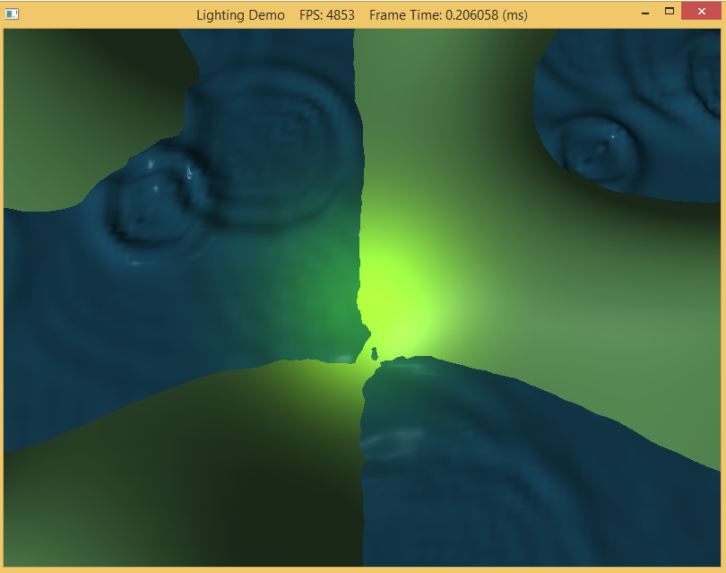

In CS370, we covered different types of lighting including ambient, diffuse, and specular and their related material properties for the objects. This lab will review the computations involved with each of these components and show how to implement them in the shader. We will also provide code to produce parallel, point, and spot lights.

0. Getting Started
==================

Download [CS470\_Lab07.zip](src/CS470_Lab07.zip), saving it into the **labs** directory.

Double-click on **CS470\_Lab07.zip** and extract the contents of the archive into a subdirectory called **CS470\_Lab07**

Navigate into the **CS470\_Lab07** directory and double-click on **CS470\_Lab07.sln** (the file with the little Visual Studio icon with the 13 on it) which should immediately open Visual Studio with the project.

1. Local Illumination Models
============================

In this model, each local object is lit independently of another object, and only the light directly emitted from the light sources is taken into account in
the lighting process (i.e., light that has bounced off other scene objects to strikes the object currently being lit is ignored).

With lighting, we no longer need to specify the vertex colors directly.  Instead, we need to specify materials and lights, and then apply the light equation which will compute the vertex colors base on the light/material interaction.

Materials can seen as properties that allow lights to interact with the surface of an object.  For instance, the colors given off by an object is determined by what was absorbed or reflected off the surface of the object.  In addition, reflectivity, transparency and shininess are all parameters that make up the material surface.  

There are different types of lights:

**Parallel Light or Directional Light** - approximates a light source that is very far away.  A parallel light source is defined by a vector, which specifies the direction the light rays travel. Because the light rays are parallel, they all use the same direction vector.

**Point Lights** - a good physical example of a point light is a lightbulb; it radiates spherically in all directions. For an arbitrary point **P**, there exists a light ray originating from the point light position **Q** traveling toward the point. As usual, we define the light vector to go in the opposite direction; that is, the direction from the point **P** to the point light source **Q**:

>  **L = (Q - P)/(||Q - P||)**

**Attenuation** - light intensity weakens as a function of distance based on the inverse squared law.  The greater the distance from the light source, the weaker the light. the light intensity at a point a distance d away from the light source is given by:

> **I(d) = I0/d^2**

where I0 is the light intensity at a distance d = 1 from the light source.  A better estimation to use his equation:

> **I(d) = I0/a0 + a1d+ a2d^2**

**Spot Lights** - a good physical example of a spotlight is a flashlight. 

> **L = (Q - P)/(||Q - P||)**
	
where **P** is the position of the point being lit and **Q** is the position of the spotlight. Observe from Figure 7.20 that P is inside the spotlight’s cone (and therefore receives light) if and only if the angle ϕ between - **L** and **d** is smaller than the cone angle ϕmax.

In this light model, a light source can emit various degree of intensities of the three primary colors:  Red, Green and Blue (RGB).  We can simulate many light colors by manipulating the three primary colors.

As stated earlier, when a light travels toward from a source and hit an object, some of that light will get absorbed and some will get reflected back.  The reflected light will travel along a new path and may collide with another object and the process repeats itself.  Obviously, the intensity of the light will get reduced as it collides with many objects along its path. 

According to the trichromatic theory[Santrock03], the retina contains three kinds of light receptors:  each one is sensitive to red, green and blue light.  The incoming light RGB light stimulates it corresponding to the strength of the light.  As light receptors are stimulated or not at all.  The neural impulses are sent down to the brain generating an image in our head based on the stimulus of the light receptors.  When we close our eyes, the receptor cells receive no stimulus and thus the brain will ultimately registers this black.

Normal Vector
-------------

Before we dive into the lab, we need to cover a few more things.  **Face Normal** - is a unit vector that describes the direction a polygon is facing and **Normal Surface** is defined as a unit vector that is orthogonal to the tangent plane of a point on a surface.

To calculate lightings, we need the surface normal at each point on the surface of a triangle mesh so that we can determine the angle at which light strikes the point on the mesh surface. 

To obtain surface normals, we specify the surface normals only at the
vertex points (so-called vertex normals). Then, in order to obtain a surface normal approximation at each point on the surface of a triangle mesh, these vertex normals will be interpolated across the triangle during rasterization.

**Computing Normal Vectors**

Find the face normal of a triangle.  For example, a triangle Δp0 p1 p2, we first compute two vectors that lie on the triangle’s edges:

> **u = p1 – p0**

> **v = p2 – p0**
	
> **n = (u x v)/(||u x v||)**

note: **n** is the vertex normals defined on the triangle p0, p1, p2 and pn.

For a differentiable surface calculations, the middle vertex is shared by the neighboring four polygons, so we approximate the middle vertex normal by averaging the four polygon
face normals.  

> **n_avg = (n0 + n1 + n2 + n3)/(||n0 + n1 + n2 + n3||)**

For details, read up chapter 7.

Lambert's Cosine Law
--------------------

Light that strikes a surface point head-on is more intense than light that just glances a surface point. The idea is to come up with a function that returns different intensities based on the alignment of the vertex normal and the light vector.

The function should return maximum intensity when the vertex normal and light vector are perfectly aligned (i.e., the angle θ between them is 0°), and it should smoothly diminish in intensity as the angle between the vertex normal and light vector increases. If θ > 90°, then the light strikes the back of a surface and so we set the intensity to zero.

2. Phong Lighting
=================

Ambient
-------

ambient light: to model indirect lighting.

Ambient light is the background light that uniformly lights all surfaces.  The **Local Illumination Models** doesn't taking into account of indirect light.  To sort of hack this indirect light, we introduce an ambient term to the lighting equation: 

> **A = la ⊗ ma**
	
where **la** is the total amount of indirect (ambient) light a surface receives from a light source.  The ambient material color **ma** specifies the amount of incoming ambient light that the surface reflects and absorbs.

All ambient light does is uniformly brighten up the object a bit—there is no real physics calculation at all. Note the two color vectors are multiplied *componentwise* (indicated by the ⊗ operator).

Diffuse
-------

diffuse light: to model the direct lighting of relatively rough surfaces.

Diffuse light is the light scattered in all directions from a surface. When light strikes a point on such a surface, the light rays scatter in various random directions; this is called a *diffuse reflection*.  Therefore, we do not need to take the viewpoint into consideration (i.e., the diffuse lighting calculation is viewpoint independent), and the color of a point on the surface will always look the same no matter the viewpoint.

Diffuse lighting calculations are separated into two parts:  For the first part, we specify a diffuse light color and a diffuse material color. The diffuse material specifies the amount of incoming diffuse light that the surface reflects and absorbs; this is handled with a component-wise color multiplication.

For example, suppose some point on a surface reflects 50% incoming red light, 100% green light, and 75% blue light, and the incoming light color is 80% intensity white light. Hence the incoming diffuse light color is given by **ld = (0.8, 0.8, 0.8)** and the diffuse material color is given by **md = (0.5, 1.0, 0.75)** then the amount of light reflected off the point is given by:

> **D = ld ⊗ md = (0.8,0.8,0.8) ⊗ (0.5,1.0,0.75) = (0.4,0.8,0.6)**

To finish the diffuse lighting calculation, we simply include Lambert’s cosine law (which controls how much of the original light the surface receives based on the angle between the surface normal and light vector). Let **ld** be the diffuse light color, **md** be the diffuse material color, and **kd = max (L · n, 0)**, where **L** is the light vector, and **n** is the surface normal. The amount of diffuse light reflected off a point is given by:

> **cd = kd · ld ⊗ md = kd D**

Specular
--------

specular light: to model the direct lighting of relatively smooth surfaces.

When light strikes such a surface, the light rays reflect sharply in a general direction
through a cone of reflectance; this is called a specular reflection. In contrast to diffuse light, specular light might not travel into the eye because it reflects in a specific direction; the specular lighting calculation is viewpoint dependent. This means that as the eye moves about the scene, the amount of specular light it receives will change.

The cone the specular light reflects through is defined by an angle ϕmax with respect to the reflection vector **r**. Intuitively, it makes sense to vary the specular light intensity based on the angle ϕ between the reflected vector **r** and the view vector

> **V = (E - P)/ (||E-P||)** 

(the unit vector from the surface point P to the eye position E)
	
specular light intensity is maximized when ϕ = 0 and smoothly decreases to zero as ϕ approaches ϕmax.

To model this mathematically, we modify the function used in Lambert’s cosine law:
Essentially, by choosing different p, we indirectly control the cone angle ϕmax where the light intensity drops to zero. The parameter p can be used to control the shininess of a surface; that is, highly polished surfaces will have a smaller cone of reflectance (the light reflects more sharply) than less shiny surfaces. So you would use a larger p for shiny surfaces than you would for matte surfaces.

Note that because **v** and **r** are unit vectors, we have that **cos(ϕ) = v ∙ r**.
The amount of specular light reflected off a point that makes it into the eye is given by:

> **Cs = ks * ls ⊗ ms**

where **ks = max (v*r)^p**, **L∙N > 0**, and =0 if L∙N <= 0.

3. Materials
============

-   *ambient material*: the amount of ambient light the surface reflects and absorbs.
-   *diffuse material*: the amount of diffuse light the surface reflects and absorbs.
-   *specular material*: the amount of specular light the surface reflects and absorbs.
-   *specular exponent*: an exponent used in the specular lighting calculation which controls the cone of reflectance, and thus how shiny the surface is. The smaller the cone, the smoother/shinier the surface.

In order to apply lighting to an object, we will modify the vertex structure and as well as create a separate material structure. In the **FX** folder, the new vertex is given in *Lighting.fx* and material structures is given in *LightHelper.fx*

In Lighting.fx

```cpp
struct VertexIn
{
	float3 PosL    : POSITION;
	float3 NormalL : NORMAL;
};

struct VertexOut
{
	float4 PosH    : SV_POSITION;
	float3 PosW    : POSITION;
	float3 NormalW : NORMAL;
};
```
	
in LightHelper.fx

```cpp	
struct Material
{
	float4 Ambient;
	float4 Diffuse;
	float4 Specular; // w = SpecPower
	float4 Reflect;
};
```

The **Mesh** for this lab is place in **LightingDemo.cpp**

```cpp
private:
	ID3DX11Effect* mFX;
	ID3DX11EffectTechnique* mTech;
	ID3DX11EffectMatrixVariable* mfxWorldViewProj;
	ID3DX11EffectMatrixVariable* mfxWorld;
	ID3DX11EffectMatrixVariable* mfxWorldInvTranspose;
	ID3DX11EffectVectorVariable* mfxEyePosW;
	ID3DX11EffectVariable* mfxDirLight;
	ID3DX11EffectVariable* mfxPointLight;
	ID3DX11EffectVariable* mfxSpotLight;
	ID3DX11EffectVariable* mfxMaterial;
```	

4. Light Sources
================

The light source properties will be stored in a structure given in **LightHelper.fx** as

```cpp
struct DirectionalLight
{
	float4 Ambient;
	float4 Diffuse;
	float4 Specular;
	float3 Direction;
	float pad;
};

struct PointLight
{ 
	float4 Ambient;
	float4 Diffuse;
	float4 Specular;

	float3 Position;
	float Range;

	float3 Att;
	float pad;
};

struct SpotLight
{
	float4 Ambient;
	float4 Diffuse;
	float4 Specular;

	float3 Position;
	float Range;

	float3 Direction;
	float Spot;

	float3 Att;
	float pad;
};
```
	
Additionally, shader variables for the light and camera position are defined *per frame* in the effect file **Lighting.fx** as

```cpp
cbuffer cbPerFrame
{
	DirectionalLight gDirLight;
	PointLight gPointLight;
	SpotLight gSpotLight;
	float3 gEyePosW;
};

cbuffer cbPerObject
{
	float4x4 gWorld;
	float4x4 gWorldInvTranspose;
	float4x4 gWorldViewProj;
	Material gMaterial;
};
```

**Compute Directional Light**

In the **LightHelper.fx**

```cpp
void ComputeDirectionalLight(Material mat, DirectionalLight L, 
						 float3 normal, float3 toEye,
						 out float4 ambient,
						 out float4 diffuse,
						 out float4 spec)
{
	// Initialize outputs.
	ambient = float4(0.0f, 0.0f, 0.0f, 0.0f);
	diffuse = float4(0.0f, 0.0f, 0.0f, 0.0f);
	spec    = float4(0.0f, 0.0f, 0.0f, 0.0f);

	// The light vector aims opposite the direction the light rays travel.
	float3 lightVec = -L.Direction;

	// Add ambient term.
	ambient = mat.Ambient * L.Ambient;	

	// Add diffuse and specular term, provided the surface is in 
	// the line of site of the light.
	
	float diffuseFactor = dot(lightVec, normal);

	// Flatten to avoid dynamic branching.
	[flatten]
	if( diffuseFactor > 0.0f )
	{
		float3 v         = reflect(-lightVec, normal);
		float specFactor = pow(max(dot(v, toEye), 0.0f), mat.Specular.w);
					
		diffuse = diffuseFactor * mat.Diffuse * L.Diffuse;
		spec    = specFactor * mat.Specular * L.Specular;
	}
}
```
	
**Point Lights**

In the LightHelper.fx

```cpp
void ComputePointLight(Material mat, PointLight L, float3 pos, float3 normal, float3 toEye,
			   out float4 ambient, out float4 diffuse, out float4 spec)
{
	// Initialize outputs.
	ambient = float4(0.0f, 0.0f, 0.0f, 0.0f);
	diffuse = float4(0.0f, 0.0f, 0.0f, 0.0f);
	spec    = float4(0.0f, 0.0f, 0.0f, 0.0f);

	// The vector from the surface to the light.
	float3 lightVec = L.Position - pos;
		
	// The distance from surface to light.
	float d = length(lightVec);
	
	// Range test.
	if( d > L.Range )
		return;
		
	// Normalize the light vector.
	lightVec /= d; 
	
	// Ambient term.
	ambient = mat.Ambient * L.Ambient;	

	// Add diffuse and specular term, provided the surface is in 
	// the line of site of the light.

	float diffuseFactor = dot(lightVec, normal);

	// Flatten to avoid dynamic branching.
	[flatten]
	if( diffuseFactor > 0.0f )
	{
		float3 v         = reflect(-lightVec, normal);
		float specFactor = pow(max(dot(v, toEye), 0.0f), mat.Specular.w);
					
		diffuse = diffuseFactor * mat.Diffuse * L.Diffuse;
		spec    = specFactor * mat.Specular * L.Specular;
	}

	// Attenuate
	float att = 1.0f / dot(L.Att, float3(1.0f, d, d*d));

	diffuse *= att;
	spec    *= att;
}
```

**Spot Lights**

```cpp
void ComputeSpotLight(Material mat, SpotLight L, float3 pos, float3 normal, float3 toEye,
				  out float4 ambient, out float4 diffuse, out float4 spec)
{
	// Initialize outputs.
	ambient = float4(0.0f, 0.0f, 0.0f, 0.0f);
	diffuse = float4(0.0f, 0.0f, 0.0f, 0.0f);
	spec    = float4(0.0f, 0.0f, 0.0f, 0.0f);

	// The vector from the surface to the light.
	float3 lightVec = L.Position - pos;
		
	// The distance from surface to light.
	float d = length(lightVec);
	
	// Range test.
	if( d > L.Range )
		return;
		
	// Normalize the light vector.
	lightVec /= d; 
	
	// Ambient term.
	ambient = mat.Ambient * L.Ambient;	

	// Add diffuse and specular term, provided the surface is in 
	// the line of site of the light.

	float diffuseFactor = dot(lightVec, normal);

	// Flatten to avoid dynamic branching.
	[flatten]
	if( diffuseFactor > 0.0f )
	{
		float3 v         = reflect(-lightVec, normal);
		float specFactor = pow(max(dot(v, toEye), 0.0f), mat.Specular.w);
					
		diffuse = diffuseFactor * mat.Diffuse * L.Diffuse;
		spec    = specFactor * mat.Specular * L.Specular;
	}
	
	// Scale by spotlight factor and attenuate.
	float spot = pow(max(dot(-lightVec, L.Direction), 0.0f), L.Spot);

	// Scale by spotlight factor and attenuate.
	float att = spot / dot(L.Att, float3(1.0f, d, d*d));

	ambient *= spot;
	diffuse *= att;
	spec    *= att;
}
```

5. Compiling and running the program
====================================

Once you have completed typing in the code, you can build and run the program in one of two ways:

> -   Click the small green arrow in the middle of the top toolbar
> -   Hit **F5** (or **Ctrl-F5**)

The output should look similar to below

> 

To quit the program simply close the window.