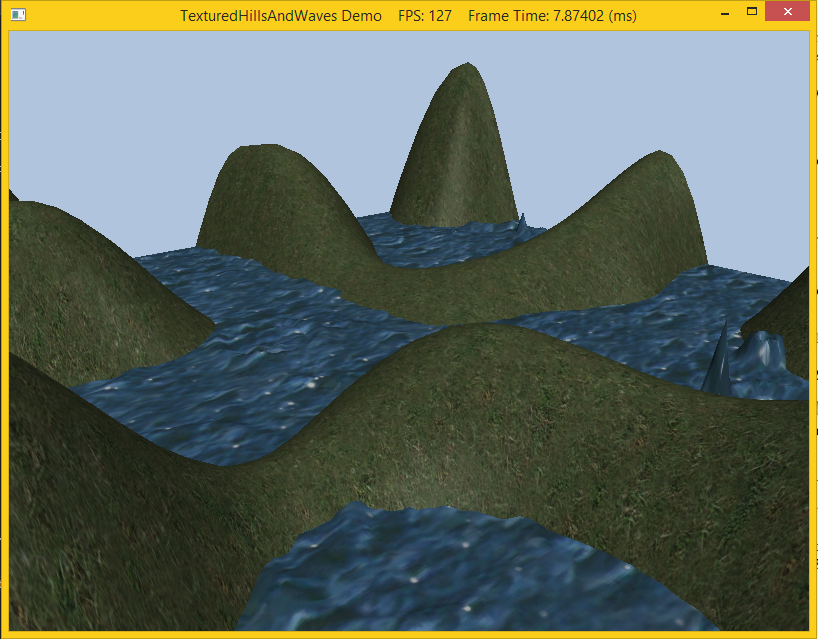

A texture is merely a 2-D array of information. The most commonly used textures are images that represent, pixel by pixel, which colors should go where. Generally, this is sent to the pixel shader, where transformations are done on the image to make the picture fit on the surface. Textures are loaded as *shader resources* (with an associated *shader resource view*) which are then bound to the desired shader. Thus textures can be used in the vertex or geometry shaders to get special effects, but this lab we will simply bind it to the pixel shader to be used as a normal texture. However since we would also like the texture to interact with light sources, rather than use a material containing *constant* diffuse and specular properties, we will load a *texture* for the diffuse and specular components (thus we can "vary" the material on a per pixel basis). Typically the standard texture image is used for the diffuse component and in this lab we will simply load a default specular texture which will not affect the final scene (the texture is simply black).

0. Getting Started
==================

Download [CS470\_Lab08-2.zip](src/CS470_Lab08-2.zip), saving it into the **labs** directory.

Double-click on **CS470\_Lab08_2.zip** and extract the contents of the archive into a subdirectory called **CS470\_Lab08_2**

1. Texture Animation
====================

In this demo, we will be making the water's texture move. To scroll a water texture over the water geometry, we translate the texture coordinates in the texture plane as a function of time in the **UpdateScene()** of **TexturedHillsAndWavesDemo.cpp** method. Provided the offset is small for each frame, this gives the illusion of a smooth animation, while a greater offset provides a faster animation. We use the wrap address mode along with a seamless texture so that we can seamlessly translate the texture coordinates around the texture space plane. The following code shows how we calculate the offset vector for the water texture, and how we build and set the water's texture matrix:

```cpp
// Tile water texture.
XMMATRIX wavesScale = XMMatrixScaling(5.0f, 5.0f, 0.0f);

// Translate texture over time.
mWaterTexOffset.y += 0.05f*dt;
mWaterTexOffset.x += 0.1f*dt;
XMMATRIX wavesOffset = XMMatrixTranslation(mWaterTexOffset.x, mWaterTexOffset.y, 0.0f);

// Combine scale and translation.
XMStoreFloat4x4(&mWaterTexTransform, wavesScale*wavesOffset);
```

2. Compiling and running the program
====================================

Once you have completed typing in the code, you can build and run the program in one of two ways:

> -   Click the small green arrow in the middle of the top toolbar
> -   Hit **F5** (or **Ctrl-F5**)

The output should look similar to below

> 

To quit the program simply close the window.
