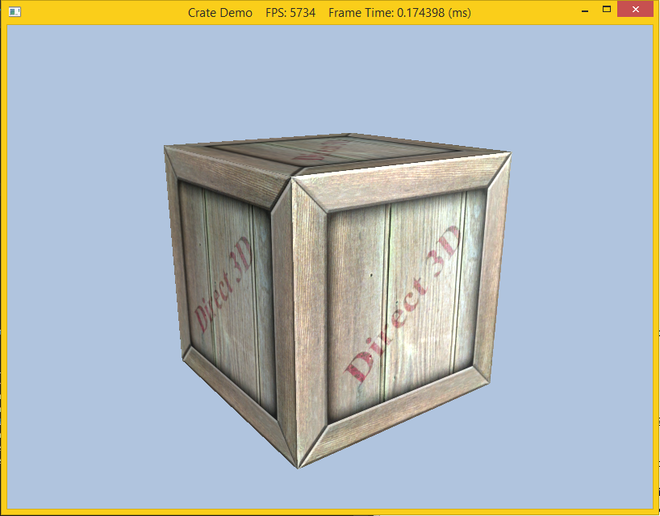

A texture is merely a 2-D array of information. The most commonly used textures are images that represent, pixel by pixel, which colors should go where. Generally, this is sent to the pixel shader, where transformations are done on the image to make the picture fit on the surface. Textures are loaded as *shader resources* (with an associated *shader resource view*) which are then bound to the desired shader. Thus textures can be used in the vertex or geometry shaders to get special effects, but this lab we will simply bind it to the pixel shader to be used as a normal texture. However since we would also like the texture to interact with light sources, rather than use a material containing *constant* diffuse and specular properties, we will load a *texture* for the diffuse and specular components (thus we can "vary" the material on a per pixel basis). Typically the standard texture image is used for the diffuse component and in this lab we will simply load a default specular texture which will not affect the final scene (the texture is simply black).

0. Getting Started
==================

Download [CS470\_Lab08.zip](src/CS470_Lab08.zip), saving it into the **labs** directory.

Double-click on **CS470\_Lab08.zip** and extract the contents of the archive into a subdirectory called **CS470\_Lab08**

1. Choosing and Using your Texture
==================================

The most important thing when texture mapping is to actually have a texture that you want to use. Any 2-D image can be used, but if you are feeling uncreative (or lazy), there are a few existing images in the **Textures** folder of your lab. Once you have selected your image, it is time to use it in the program. In the **Init()** method of **Crate.cpp**, we load our texture as follows

```cpp
HR(D3DX11CreateShaderResourceViewFromFile(md3dDevice, L"Destination of your Texture file", 0, 0, &mDiffuseMapSRV, 0)); 
```

2. Texture Coordinates
======================

Next, we modify our vertex structure once again and add a pair of texture coordinates that identify a point on the texture. Now every 3D vertex has a corresponding 2D texture vertex. Thus, every 3D triangle defined by three vertices also defines a 2D triangle in texture space (i.e., we have associated a 2D texture triangle for every 3D triangle).

```cpp
// Basic 32-byte vertex structure.
struct Basic32
{
    D3DXVECTOR3 Pos;
    D3DXVECTOR3 Normal;
    D3DXVECTOR2 Tex;
};  
```

The vertex layout adds three fields in **Vertex.cpp** as

```cpp
const D3D11_INPUT_ELEMENT_DESC InputLayoutDesc::Basic32[3] = 
{
    {"POSITION", 0, DXGI_FORMAT_R32G32B32_FLOAT, 0, 0, D3D11_INPUT_PER_VERTEX_DATA, 0},
    {"NORMAL",   0, DXGI_FORMAT_R32G32B32_FLOAT, 0, 12, D3D11_INPUT_PER_VERTEX_DATA, 0},
    {"TEXCOORD", 0, DXGI_FORMAT_R32G32_FLOAT, 0, 24, D3D11_INPUT_PER_VERTEX_DATA, 0}
};
```

Note that since the normal is also a 3D vector (comprised of 12 bytes), the texture coordinate will be offset by 24 bytes and be 2 32-bit float values. Otherwise there are no other changes needed to the application code.

The remainder of the work is done in the basic file.

3. Basic File
=============

Since we will simply be replacing the previous material with the
information passed via the textures, we can use the exact same
**LightHelper.fx** file (including all the lighting structures). In the primary effect file **Basic.fx** we will remove the material and add the texture transformation matrix in the per object data

```cpp
cbuffer cbPerObject
{
    float4x4 gWorld;
    float4x4 gWorldInvTranspose;
    float4x4 gWorldViewProj;
    float4x4 gTexTransform;
    Material gMaterial;
};
```

We then add a shader variable for the textures as **Texture2D** value

```cpp
// Texture variables
Texture2D gDiffuseMap;
```

Next we will create a **SamplerState** variable to set how minification, magnification, and mipmapping should be done for the texture map. Each component can be set separately, but we will simply set them all to **ANISOTROPIC** interpolation. We can also set how the texture wraps in both the **U** (which is the **x** or **s** axis) and the **V** (which is the **y** or **t** axis) directions for the texture. We will simply set them to **WRAP** (which is the default value)

```cpp
// Set texture sample state
SamplerState samAnisotropic
{
    Filter = ANISOTROPIC;

    MaxAnisotropy = 4;

    AddressU = WRAP;
    AddressV = WRAP;
};
```

We also need to add fields in **VertexIn** and **VertexOut** for the original and transformed texture coordinates

```cpp
struct VertexIn
{
    float3 PosL     : POSITION;
    float3 NormalL  : NORMAL;

    float2 Tex      : TEXCOORD;
};

struct VertexOut
{
    float4 PosH     : SV_POSITION;
    float3 PosW     : POSITION;
    float3 NormalW  : NORMAL;

    float2 Tex     : TEXCOORD;
};
```

In the vertex shader **VS()**, we need to transform the texture
coordinates by the texture transformation and pass them to the pixel shader

```cpp
// Transform to world space space.
vout.PosW    = mul(float4(vin.PosL, 1.0f), gWorld).xyz;
vout.NormalW = mul(vin.NormalL, (float3x3)gWorldInvTranspose);
        
// Transform to homogeneous clip space.
vout.PosH = mul(float4(vin.PosL, 1.0f), gWorldViewProj);
    
// Output vertex attributes for interpolation across triangle.
vout.Tex = mul(float4(vin.Tex, 0.0f, 1.0f), gTexTransform).xy;
```

4. Compiling and running the program
====================================

Once you have completed typing in the code, you can build and run the program in one of two ways:

> -   Click the small green arrow in the middle of the top toolbar
> -   Hit **F5** (or **Ctrl-F5**)

The output should look similar to below

> 

To quit the program simply close the window.
