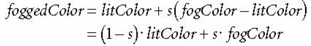

We began learning about blending and what could be done with it last class with a lab that created transparent water. Today, we will learn about creating fog effects. Fog is useful in many ways: for one, fog effects help simulate different weather conditions. It is also useful to use small levels of fog to create an atmospheric perspective where distant objects appear blurred and distorted. A better benefit of using fog effects is to mask any popping that may occur. Popping is when an object behind the far plane becomes renderable by coming in front of the frustum; the object appears to just 'pop' into existence rather suddenly. Having a layer of fog can help hide objects that suddenly pop into visible range. 

0. Getting Started
==================

Download [CS470\_Lab09-2.zip](src/CS470_Lab09-2.zip), saving it into the **labs** directory.

Double-click on **CS470\_Lab09-2.zip** and extract the contents of the archive into a subdirectory called **CS470\_Lab09-2**


1. How Fog Works
================

Creating a fog effect essentially works by making a starting distance for when the fog begins as well as a ranged distance for how far the fog should go and a fog color. Anything between the position of the camera and the starting distance of the fog will not be affected by the fog effect. 

From the fog starting point, the fog effect will start and gradually become thicker until it reaches the fog range where any objects past that point will be completely hidden. This blending effect combines the colors from lighting effects with the color of the fog. The equation below shows how the fog color and light color are combined. 

> 

> 

> 

2. Let's make Fog
=================

In the lab today, we will add onto the lab from the previous class and create a fog effect emanating from the center of the terrain.

First thing we need to do is to create a struct that will store our values for the camera position, the fog start distance, the fog range and the fog color. Create this struct in the **Basic.fx** file. (Note: the structure is made for you, just create the variables that are part of the structure)

```cpp
cbuffer cbPerFrame
{
	DirectionalLight gDirLights[3];

	//TODO: create variables for the camera position, fog start & range positions and fog color. 
	float3 gEyePosW;

	float  gFogStart;
	float  gFogRange;
	float4 gFogColor;
};
```  

Then we need to do the actual blending in the **Basic.fx** file in the **PS( )** method. As seen in the equation we saw at the beginning of this lecture, we find the saturation of the fog color using the saturate function which will return the percentage of fog color that will be blended with the light color. Once we find the saturation, we can then do the actual blending of color. We then set the alpha of the light color to the product of the diffuse material and the textures's alpha component.

```cpp
//TODO: perform blending of light color and fog color

// Get the saturation of the fog color
float fogLerp = saturate( (distToEye - gFogStart) / gFogRange ); 

// Blend the fog color and the lit color.
litColor = lerp(litColor, gFogColor, fogLerp);

// Common to take alpha from diffuse material and texture.
litColor.a = gMaterial.Diffuse.a * texColor.a;
```

Lastly, in **BlendDemo.cpp** in the **DrawScene( )** method we call the techniques from the **BasicFX** that will render all the shader effects. 

```cpp
//TODO: call shader effects
boxTech = Effects::BasicFX->Light3TexAlphaClipFogTech;
landAndWavesTech = Effects::BasicFX->Light3TexFogTech;
```


Compiling and running the program
===========================

Once you have completed typing in the code, you can build and run the program in one of two ways:

> -   Click the small green arrow in the middle of the top toolbar
> -   Hit **F5** (or **Ctrl-F5**)

The output should look similar to below

> 

To quit the program simply close the window.
