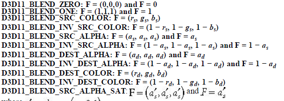

Blending is a method of combining pixels we are currently rasterizing with pixels on the back buffer that have already been rasterized. If you recall with OpenGL from CS370, we used a form of blending called alpha blending to make objects transparent. In the lab today, we will use blending with DirectX to make transparent water that will travel across a grassy terrain. 

0. Getting Started
==================

Download [CS470\_Lab09.zip](src/CS470_Lab09.zip), saving it into the **labs** directory.

Double-click on **CS470\_Lab09.zip** and extract the contents of the archive into a subdirectory called **CS470\_Lab09**

1. The Blending Equation
========================

Blending is done by combining the pixels currently being rasterized (source pixels) with pixels that have already been rasterized (destination pixels). The blending of these source and destination pixels is done using the following equation:

> 

**C_src** is the color of the source pixel currently being rasterized. **C_dst** is the color of the destination pixel that is on the back buffer. **F_src** is the blend factor of the source pixel and **F_dst** is the blend factor of the destination pixel. The color of a pixel is made by the product of the source pixel and its blend factor done with a binary operator on the product of the destination pixel and its blend factor. Note that 
the blending RGB components are done seperately from the blending of the alpha component. The equation to determine the blending of the alpha component is essentially the same as the equation for blending the RGB component, simply replace the color components with the alpha component:

>  

2. Blending Factors
==============

By using different kinds of blend factors we can create dozens of different effects. Some of the most basic are listed below: 

> 

3. Blending Operations
==============

As with blend factors, using different operations will produce different effects. 

> 

Here are some examples of what effects different operations create:

D3D11_BLEND_OP_ADD 
------------------

> 

Using the adding operation can create a brighter image because color is being added. 

Note: this effect can also be implemented by setting the **D3D11_RENDER_TARGET_BLEND_DES::RenderTargetWriteMask** member to zero;

D3D11_BLEND_OP_SUBTRACT
-----------------------

> 

Using the subtraction operation can create a darker image since color is being removed. 

4. Blend State
==============

We've talked about blend factors and blend operations, now it is time to talk about the blend state. The blend state is controlled by the  D3D11_BLEND_DESC structure:

```cpp
typedef struct D3D11_BLEND_DESC {
	BOOL AlphaToCoverageEnable;
	BOOL IndependentBlendEnable;
	D3D11_RENDER_TARGET_BLEND_DESC RenderTarget[8];
} D3D11_BLEND_DESC;
```

-    **AlphaToConverageEnable** -  When set to true enables a multisampling technique when rendering foliage or gate textures. This by default is set to false; if set to true multisampling must also be enabled. 

-    **IndependentBlendEnable** -  When set to true, each RenderTarget may be blended with different factors and operations. If set to false, then all RenderTargets will be rendered in the same way as RenderTarget[0].

-    **RenderTarget** - an array of eight **D3D11_RENDER_TARGET_BLEND_DESC** elements. 

Each RenderTarget has several variables to set blend factors, blend operations and which color channels in the back buffer to overwrite

```cpp
typedef struct D3D11_RENDER_TARGET_BLEND_DESC {

BOOL BlendEnable; 					//enable/disable blending
D3D11_BLEND SrcBlend; 				//specifies the blend factor for the source pixel			
D3D11_BLEND DestBlend; 				//specifies the blend factor for the destination pixel		
D3D11_BLEND_OP BlendOp; 			//specifies the RGB blending operation	
D3D11_BLEND SrcBlendAlpha; 			//specifies blend factor for source pixel's alpha component			
D3D11_BLEND DestBlendAlpha; 		//specifies the blend factor destination pixel's alpha component		
D3D11_BLEND_OP BlendOpAlpha; 		//the blending operation for the Alpha component			
UINT8 RenderTargetWriteMask;		//specifies which color channels in the back buffer to write to after blending	
```

5. Transparency (Alpha Blending)
================================

The first thing we need to do is to create an instance of the **ID3D11BlendState** interface for our objects. Go to **RenderStates.h** and add the following line to the header file. 

```cpp
//TODO: add ID3D11BlendState
static ID3D11BlendState* TransparentBS;
```

In **RenderStates.cpp**  in the **InitAll()** method, add a pointer to a **ID3D11BlendState** called **RenderStates::TransparentBS**. Remember to set both of them to zero.

```cpp
// init blendStates
ID3D11BlendState*      RenderStates::TransparentBS     = 0;
```

Then we initialize a **D3D11_BLEND_DESC** structure and set the **AlphaToCoverageEnable** and **IndependentBlendEnable** to *false*. 

```cpp
//TODO: init a D3D11_BLEND_DESC
D3D11_BLEND_DESC transparentWater = {0};

//set blend state
transparentWater.AlphaToCoverageEnable = false;
transparentWater.IndependentBlendEnable = false;
```

We want to set our **RenderTarget** to have blending enabled. Since we want the water to be transparent we need to set the source pixel's blend factor to equal to its alpha component so we set the **SrcBlend** to **D3D11_BLEND_SRC_ALPHA** and we set the source pixel's alpha to one using the proper enumeration.

For the destination pixel we need the blend factor to be the inverse of the of the source alpha and the destination alpha will be zero since the source pixel is the pixel that will be transparent. 

Since we are working with transparency we need to set the blend operation to **D3D11_BLEND_OP_ADD** since we are combining the colors of the source and destination pixels. We set the RenderTargetWriteMask to write to all the color components.
 
```cpp
//TODO: set blending factors
//set blend factors and alphas for source and destination pixels and set blend operation
transparentWater.RenderTarget[0].BlendEnable 			= true;
transparentWater.RenderTarget[0].SrcBlend       		= D3D11_BLEND_SRC_ALPHA;
transparentWater.RenderTarget[0].DestBlend      		= D3D11_BLEND_INV_SRC_ALPHA;
transparentWater.RenderTarget[0].BlendOp        		= D3D11_BLEND_OP_ADD;
transparentWater.RenderTarget[0].SrcBlendAlpha  		= D3D11_BLEND_ONE;
transparentWater.RenderTarget[0].DestBlendAlpha 		= D3D11_BLEND_ZERO;
transparentWater.RenderTarget[0].BlendOpAlpha   		= D3D11_BLEND_OP_ADD;
transparentWater.RenderTarget[0].RenderTargetWriteMask 	= D3D11_COLOR_WRITE_ENABLE_ALL;
```

We then need to call **CreateBlendState()** method to set all the values we declared for the **D3D11_BLEND_DESC**.

```cpp
//TODO: call CreateBlendState
HR(device->CreateBlendState(&transparentWater, &TransparentBS));
```

Lastly, We need to call the **RenderStates** class in **BlendDemo.cpp** in the **Init()** method in order to have any of our blending effects take effect. 

```cpp
//TODO: init RenderStates effects
RenderStates::InitAll(md3dDevice);
```

Here is the math to what we have done:

> 

Basically we are multiplying the each of the RGB components by the source pixel's alpha and multiplying the destination RGB components the the inverse of the source's alpha. 
Then both pixel colors are added together to create the new color that will overwrite the destination pixel. 

6. Compiling and running the program
====================================

Once you have completed typing in the code, you can build and run the program in one of two ways:

> -   Click the small green arrow in the middle of the top toolbar
> -   Hit **F5** (or **Ctrl-F5**)

The output should look similar to below

> 

To quit the program simply close the window.
