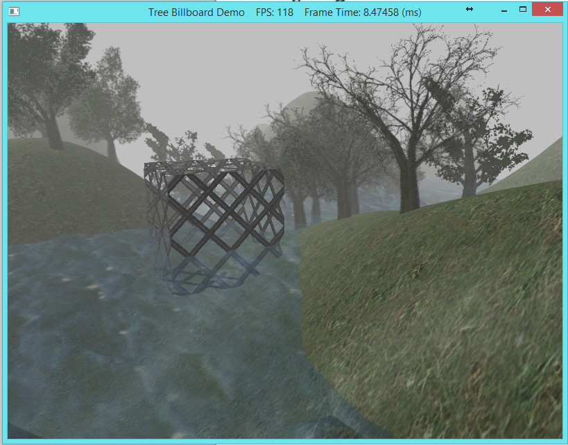

In OpenGL, when we wanted to subdivide something recursively, we needed to use the SLOW system processor to do that. Now using Shader Model 5.0, we can use the newest part of the of the GPU pipeline to generate more vertices in the pipeline. The geometry shader can create or destroy geometry in the pipeline. One input primitive may be able to be divided into several primitives (Like recursive subdivision). The geometry shader can also take in one type of primitive and output another type of primitive. For example in this lab, we'll take in a point and transform that into a quad.

0. Getting Started
==================

Download [CS470\_Lab10.zip](src/CS470_Lab10.zip), saving it into the **labs** directory.

Double-click on **CS470\_Lab10.zip** and extract the contents of the archive into a subdirectory called **CS470\_Lab10**

Navigate into the **Geometry Shader** directory and double-click on **CS470\_Lab10.sln**  which should immediately open Visual Studio with the project.

If the **Header Files**, **Resource Files** and **Source Files** folders in the **Solution Explorer** pane are not expanded, expand each by double clicking on them and double-click on **Mesh.h**, **Mesh.cpp**, **BasicMeshApp.h** and **BasicMeshApp.cpp**.

1. Vertex Structure
===================

In this application, we'll define a vertex structure to define the center of a billboarded object. This struct will also define the size of the billboarded object.

To define this vertex structure, add a struct to **Vertex.h**:

```cpp
struct TreePointSprite
{
	
	XMFLOAT3 Pos;
	XMFLOAT2 Size;
};
```

2. Texture Arrays
=================

In this Luna uses texture arrays to pass his textures to the shader. Texture arrays are defined using the texture description within **D3DX11Util.h**

```cpp 
typedef struct D3DX11_IMAGE_LOAD_INFO
{
    UINT                       Width;
    UINT                       Height;
    UINT                       Depth;
    UINT                       FirstMipLevel;
    UINT                       MipLevels;
    D3D11_USAGE                Usage;
    UINT                       BindFlags;
    UINT                       CpuAccessFlags;
    UINT                       MiscFlags;
    DXGI_FORMAT                Format;
    UINT                       Filter;
    UINT                       MipFilter;
    D3DX11_IMAGE_INFO*         pSrcInfo;
    

    D3DX11_IMAGE_LOAD_INFO()
    {
        Width = D3DX11_DEFAULT;
        Height = D3DX11_DEFAULT;
        Depth = D3DX11_DEFAULT;
        FirstMipLevel = D3DX11_DEFAULT;
        MipLevels = D3DX11_DEFAULT;
        Usage = (D3D11_USAGE) D3DX11_DEFAULT;
        BindFlags = D3DX11_DEFAULT;
        CpuAccessFlags = D3DX11_DEFAULT;
        MiscFlags = D3DX11_DEFAULT;
        Format = DXGI_FORMAT_FROM_FILE;
        Filter = D3DX11_DEFAULT;
        MipFilter = D3DX11_DEFAULT;
        pSrcInfo = NULL;
    }  

} D3DX11_IMAGE_LOAD_INFO;
```

We'll start loading in the textures by loading texture into the program one-by-one. In DX11, Luna includes this in his **d3dUtil.cpp** file, which can be seen as follows.

```cpp
std::vector<ID3D11Texture2D*> srcTex(size);
for(UINT i = 0; i < size; ++i)
{
	D3DX11_IMAGE_LOAD_INFO loadInfo;

	loadInfo.Width  = D3DX11_FROM_FILE;
	loadInfo.Height = D3DX11_FROM_FILE;
	loadInfo.Depth  = D3DX11_FROM_FILE;
	loadInfo.FirstMipLevel = 0;
	loadInfo.MipLevels = D3DX11_FROM_FILE;
	loadInfo.Usage = D3D11_USAGE_STAGING;
	loadInfo.BindFlags = 0;
	loadInfo.CpuAccessFlags = D3D11_CPU_ACCESS_WRITE | D3D11_CPU_ACCESS_READ;
	loadInfo.MiscFlags = 0;
	loadInfo.Format = format;
	loadInfo.Filter = filter;
	loadInfo.MipFilter = mipFilter;
	loadInfo.pSrcInfo  = 0;

	HR(D3DX11CreateTextureFromFile(device, filenames[i].c_str(), 
		&loadInfo, 0, (ID3D11Resource**)&srcTex[i], 0));
}
```

In this you will notice there is significantly more to the loading. We have to define the load information from the file so that we can use that late to create our texture array. Next we'll add code to create our texture array.

```cpp
// Create the texture array.  Each element in the texture 
// array has the same format/dimensions.
//

D3D11_TEXTURE2D_DESC texElementDesc;
srcTex[0]->GetDesc(&texElementDesc);

D3D11_TEXTURE2D_DESC texArrayDesc;
texArrayDesc.Width              = texElementDesc.Width;
texArrayDesc.Height             = texElementDesc.Height;
texArrayDesc.MipLevels          = texElementDesc.MipLevels;
texArrayDesc.ArraySize          = size;
texArrayDesc.Format             = texElementDesc.Format;
texArrayDesc.SampleDesc.Count   = 1;
texArrayDesc.SampleDesc.Quality = 0;
texArrayDesc.Usage              = D3D11_USAGE_DEFAULT;
texArrayDesc.BindFlags          = D3D11_BIND_SHADER_RESOURCE;
texArrayDesc.CPUAccessFlags     = 0;
texArrayDesc.MiscFlags          = 0;

ID3D11Texture2D* texArray = 0;
HR(device->CreateTexture2D( &texArrayDesc, 0, &texArray));
```

As you can see, in the texture description Luna uses the first texture to define the number of mip levels that should be declared. Also you can see the **ArraySize** element that declares the size of the array. Finally, move the array of textures we loaded from files into a texture array.

```cpp
// for each texture element...

for(UINT texElement = 0; texElement < size; ++texElement)
{
	// for each mipmap level...
	for(UINT mipLevel = 0; mipLevel < texElementDesc.MipLevels; ++mipLevel)
	{
		D3D11_MAPPED_SUBRESOURCE mappedTex2D;
		HR(context->Map(srcTex[texElement], mipLevel, D3D11_MAP_READ, 0, &mappedTex2D));

		context->UpdateSubresource(texArray, 
			D3D11CalcSubresource(mipLevel, texElement, texElementDesc.MipLevels),
			0, mappedTex2D.pData, mappedTex2D.RowPitch, mappedTex2D.DepthPitch);

		context->Unmap(srcTex[texElement], mipLevel);
	}
}	
```

As you can see we need to not only load in each texture but also each mip level from that texture as well. We use the **updateSubresource()** method to use the CPU to copy that texture subresource from its original place in memory to the **texArray**. Lastly, create a resource view to the texture array so that it's accessible in the shader.

```cpp
// Create a resource view to the texture array.
//

D3D11_SHADER_RESOURCE_VIEW_DESC viewDesc;
viewDesc.Format = texArrayDesc.Format;
viewDesc.ViewDimension = D3D11_SRV_DIMENSION_TEXTURE2DARRAY;
viewDesc.Texture2DArray.MostDetailedMip = 0;
viewDesc.Texture2DArray.MipLevels = texArrayDesc.MipLevels;
viewDesc.Texture2DArray.FirstArraySlice = 0;
viewDesc.Texture2DArray.ArraySize = size;

ID3D11ShaderResourceView* texArraySRV = 0;
HR(device->CreateShaderResourceView(texArray, &viewDesc, &texArraySRV));
```

3. Effect File
==============

The pixel shader in this example does fairly little. Basically it takes in the center point of the object we want to draw and the size of the object we want to draw as well. It then passes the same information out.

```cpp
VertexOut VS(VertexIn vin)
{

	VertexOut vout;

	// Just pass data over to geometry shader.
	vout.CenterW = vin.PosW;
	vout.SizeW   = vin.SizeW;

	return vout;
}
```

Now we move on to the effect file, in this file we'll add the function that defines functionality in the geometry shader. We'll begin by defining the struct in the shader that contains the information that we want the Geometry shader to return.

Add this code to the Tree Sprite effect file:

```cpp
//Add Geometry shader return 

struct GeoOut
{

    float4 PosH    : SV_POSITION;
    float3 PosW    : POSITION;
    float3 NormalW : NORMAL;
    float2 Tex     : TEXCOORD;
    uint   PrimID  : SV_PrimitiveID;
};
```

We see that the geometry shader returns everything that would normally be passed from the vertex shader into the pixel shader. However, thanks to the geometry shader we can now calculate these vertices in the graphics card. All of the returned values should look very familiar except for the **SV_PrimitiveID**. This is no more than an index of the vertices created in the geometry shader.

To begin programming the Geometry Shader, we'll add code in the effect file to define the Geometry Shader function:

```cpp
[maxvertexcount(4)]
void GS(point VertexOut gin[1], 
		uint primID : SV_PrimitiveID, 
		inout TriangleStream<GeoOut> triStream)
```

The **[maxvertexcount(N)]** statement determines the max number of vertices the geometry shader can create at any time. This is important for program safety so that a program does not accidentally begin outputting an infinite number of vertices. The first parameter in the function is the input statement which takes in the output of the vertex shader. The second statement is an unsigned integer that tells the geometry shader to output an index for each vertex. The third statement defines that output of the geometry shader. Next we'll add code to compute a quad from the center vertex.

Add this code:

```cpp
float halfWidth  = 0.5f*gin[0].SizeW.x;
float halfHeight = 0.5f*gin[0].SizeW.y;

float4 v[4];
v[0] = float4(gin[0].CenterW + halfWidth*right - halfHeight*up, 1.0f);
v[1] = float4(gin[0].CenterW + halfWidth*right + halfHeight*up, 1.0f);
v[2] = float4(gin[0].CenterW - halfWidth*right - halfHeight*up, 1.0f);
v[3] = float4(gin[0].CenterW - halfWidth*right + halfHeight*up, 1.0f);
```

This computes a quad from the vertex given. Add another couple lines at the top of the class in **cbFixed** to generate texture coordinates for the new quad.

```cpp
float2 gTexC[4] = 
{
	float2(0.0f, 1.0f),
	float2(0.0f, 0.0f),
	float2(1.0f, 1.0f),
	float2(1.0f, 0.0f)
};
```

Follow this by adding code to make the billboard line up with the Y-axis and the camera.

```cpp
float3 up = float3(0.0f, 1.0f, 0.0f);
float3 look = gEyePosW - gin[0].CenterW;
look.y = 0.0f; // y-axis aligned, so project to xz-plane
look = normalize(look);
float3 right = cross(up, look);
```

This aligns the object up with the camera. Lastly, we'll add code to add output to the geometry shader to send to the pixel shader.

```cpp
GeoOut gout;

[unroll]

for(int i = 0; i < 4; ++i)
{
	gout.PosH     = mul(v[i], gViewProj);
	gout.PosW     = v[i].xyz;
	gout.NormalW  = look;
	gout.Tex      = gTexC[i];
	gout.PrimID   = primID;
	
	triStream.Append(gout);
}
```

This declares **GeoOut** and then makes a loop that sets the position, world position, normal and texture coordinate. Finally we append each vertex to a triangle strip using the built-in append method.

In the pixel shader, we'll load in the texture by generating the uv coordinates using the primitive ID and the texture coordinates we created.

Finally, down at the bottom of **TreeSprite.fx** the geometry shader version is set to be compiled.

```cpp
SetGeometryShader( CompileShader( gs_5_0, GS() ) );
```

4. Compiling and running the program
====================================

Once you have completed typing in the code, you can build and run the program in one of two ways:

> -   Click the small green arrow in the middle of the top toolbar
> -   Hit **F5** (or **Ctrl-F5**)

The output should look similar to below

> 

To quit the program simply close the window.