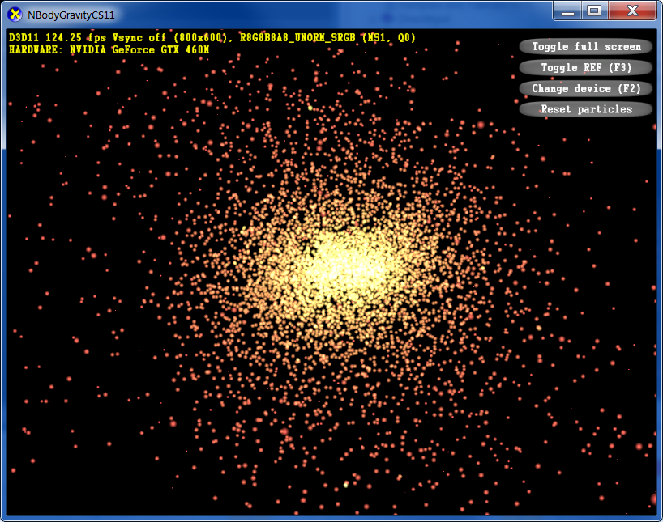

0. Getting Started
==================

Open the DirectX Sample Browser found in the DirectX SDK that we installed at the beginning of the course.  Default directory is:

>   **C:\Program Files (x86)\Microsoft DirectX SDK (June 2010)\Samples\SampleBrowser\SampleBrowser.exe**

Search for "NBodyGravityCS11".  You can choose to install the project and browse through the source code in Visual Studio, or simply run the program by clicking on either Executable links (note: going Fullscreen may cause the program to crash).

Documentation may be found by clicking on the Documentation link, and is also opened when either Executable option is selected.

The program uses the Compute Shader to store the position and velocity of each particle as well as updating the particles.

> 