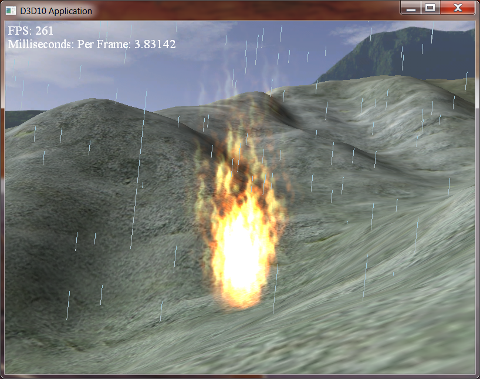

0. Getting Started
==================

Download [CS470\_Lab11.zip](src/CS470_Lab11.zip), saving it into the **labs** directory.

Double-click on **CS470\_Lab11.zip** and extract the contents of the archive into a subdirectory called **CS470\_Lab11**

In this lab, you will be editing the files **Fire.fx** and **ParticleSystem.cpp**

1. Particle Representation
==========================

Similar to the way we use points to render the trees in [Lab 10](lab10.html), particle systems makes each particle that it renders into a point. These points are slightly different from those of the previous lab in that they are given an initial velocity, age, and type.  The following struct is found in **Vertex.h**:

```cpp
struct Particle {
	XMFLOAT3 initialPos;
	XMFLOAT3 initialVel;
	XMFLOAT2 size;
	float age;
	unsigned int type;
};
```

2. Particle Motion
==================

Particle motion allows for each point to move in its own unique way, while retaining a sense of uniformity throughout the system being created. A fairly straightforward and popular approach based on simple Newtonian physics for particle motion would be the equation:

    p(t) = 1/2t^2a + tv0 + p0

For this equation, **a** always represents the acceleration of each particle. Acceleration due to gravity (-9.8 m/s^2) is the most common value of **a**.

3. Randomness
=============

In order to allow the particles to start at different positions, travel at different angles and speeds, we add randomness to the system. Luna uses the functions **RandF()** and **RandUnitVec3()** (found in **MathHelper.h/.cpp**) to randomly initialize particles at the application level. We also need to have a form of randomness within the shader, which is a bit trickier in that there are no function calls for random numbers. The following code shows how values are randomly generated at the shader level.

```cpp
// Shader Random Code
// Returns random float in [0, 1).
static float RandF()
{
	return (float)(rand()) / (float)RAND_MAX;
}

// Returns random float in [a, b).
static float RandF(float a, float b)
{
	return a + RandF()*(b-a);
}

// Returns random vector on the unit sphere.
XMVECTOR MathHelper::RandUnitVec3()
{
	XMVECTOR One = XMVectorSet(1.0f, 1.0f, 1.0f, 1.0f);
	XMVECTOR Zero = XMVectorZero();
	
	// Keep trying until we get a point on/in the hemisphere.
	while(true)
	{
		// Generate random point in the cube [-1,1]^3.
		XMVECTOR v = XMVectorSet(
			MathHelper::RandF(-1.0f, 1.0f),
			MathHelper::RandF(-1.0f, 1.0f),
			MathHelper::RandF(-1.0f, 1.0f), 0.0f);
			
		// Ignore points outside the unit sphere in order to
		// get an even distribution over the unit sphere. Otherwise
		// points will clump more on the sphere near the corners
		// of the cube.
		
		if(XMVector3Greater(XMVector3LengthSq(v), One))
			continue;
		
		return XMVector3Normalize(v);
	}
}
```

What this code does is it creates a texture based on time. First we load in a fixed number of textures, and then based on a time offset, we can sample one of these textures in a 'random' fashion.

4. Stream Output
================

Stream Output allows us to send geometry that was created in the geometry shader to a vertex buffer. This is useful for particle systems because now, rather than updating our system on the CPU, we can use a seperate geometry shader, whose sole purpose is to update the particle system, to render our geometry at a later time.

The first thing we need to do is make sure that our stream output doesn't get rendered, because we only want it to update the particle system, and not render it. This is accomplished by disabling rasterization by turning off the pixel shader, and the depth stencil buffer.

Add the following code to **Fire.fx** to disable rasterization.

```cpp
// Disable Rasterization
DepthStencilState DisableDepth
{
    DepthEnable = FALSE;
    DepthWriteMask = ZERO;
};
```

Next we need to define our stream output.

```cpp
// Define Stream Output
GeometryShader gsStreamOut = ConstructGSWithSO( 
	CompileShader( gs_5_0, StreamOutGS() ), 
	"POSITION.xyz; VELOCITY.xyz; SIZE.xy; AGE.x; TYPE.x" );
```

We also need to define the stream output technique.

```cpp
// Define the Stream Output Technique
technique11 StreamOutTech
{
    pass P0
    {
        SetVertexShader( CompileShader( vs_5_0, StreamOutVS() ) );
        SetGeometryShader( gsStreamOut );
        
        // disable pixel shader for stream-out only
        SetPixelShader(NULL);
        
        // we must also disable the depth buffer for stream-out only
        SetDepthStencilState( DisableDepth, 0 );
    }
}
```

**Creating a Vertex Buffer for Stream Output**

In order to bind a vertex buffer to a stream output, the vertex buffer must be created with the **D3D11\_BIND\_STREAM\_OUTPUT** flag. The **D3D11\_BIND\_VERTEX\_BUFFER** needs to be set as well, due to the fact that the vertex buffer will need to be used later in the pipeline.

The following code, placed in **ParticleSystem.cpp**, initializes the vertex buffer in the application.

```cpp
D3D11_BUFFER_DESC vbd;
vbd.Usage = D3D11_USAGE_DEFAULT;
vbd.ByteWidth = sizeof(Vertex::Particle) * 1;
vbd.BindFlags = D3D11_BIND_VERTEX_BUFFER;
vbd.CPUAccessFlags = 0;
vbd.MiscFlags = 0;
vbd.StructureByteStride = 0;
```

**Binding/Unbinding to the Stream Output Stage**

In order to bind a vertex buffer to the stream output stage, the following code is used.

```cpp
// Method for Binding to the SO stage 
void ID3D11Device::SOSetTargets(
	UINT NumBuffers, 
	ID3D11Buffer *const *ppSOTargets,
	const UINT *pOffsets);
```

Unbinding from the stream output stage is done by binding a new buffer(normally NULL) to the stream output stage. That code looks like this

```cpp
// Unbinding from the SO stage
ID3D11Buffer* bufferArray[1] = {0};
md3dDevice->SOSetTargets(1, bufferArray, &offset);
```

5. GPU Based Particle Systems
=============================

The particle system class handles related code for creating, updating, and drawing a particle system.

**Emitter Particles** Emitter particles are different from normal particles in that they allow the geometry shader to create and destroy particles. Depending upon the type of particle system, generally once a specific criteria is met, an emitter particle will spawn other particles.

Our particle system will be initialized by a single emitter particle, which will in turn create a full particle system.

**The Update/Draw Method**

In order to render our particle system, we'll need two techniques. A stream output technique that updates the particle system, and a second technique used to render the particles.

Add the following code to **ParticleSystem.cpp** in order to use the first technique to update the particle system.

```cpp
//
// Draw the current particle list using stream-out only to update them.  
// The updated vertices are streamed-out to the target VB. 
//
dc->SOSetTargets(1, &mStreamOutVB, &offset);

D3DX11_TECHNIQUE_DESC techDesc;
mFX->StreamOutTech->GetDesc( &techDesc );
for(UINT p = 0; p < techDesc.Passes; ++p)
{
	mFX->StreamOutTech->GetPassByIndex( p )->Apply(0, dc);
	
	if( mFirstRun )
	{
		dc->Draw(1, 0);
		mFirstRun = false;
	}
	else
	{
		dc->DrawAuto();
	}
}

// done streaming-out--unbind the vertex buffer
ID3D11Buffer* bufferArray[1] = {0};
dc->SOSetTargets(1, bufferArray, &offset);

// ping-pong the vertex buffers
std::swap(mDrawVB, mStreamOutVB);
```

Add the following code in order to use the second technique to draw the particles.

```cpp
//
// Draw the updated particle system we just streamed-out. 
//
dc->IASetVertexBuffers(0, 1, &mDrawVB, &stride, &offset);

mFX->DrawTech->GetDesc( &techDesc );
for(UINT p = 0; p < techDesc.Passes; ++p)
{
	mFX->DrawTech->GetPassByIndex( p )->Apply(0, dc);
	
	dc->DrawAuto();
}

```

6. Fire
=======

Now that our application is set up, it's time to begin writing our particle system techniques. First, we'll write our technique to update the particle system. The first technique is responible for emitting new particles, as well as destroying old ones.

Create a new geometry shader by adding the following in **Fire.fx**

```cpp
// The stream-out GS is just responsible for emitting 
// new particles and destroying old particles.  The logic
// programed here will generally vary from particle system
// to particle system, as the destroy/spawn rules will be 
// different.
[maxvertexcount(2)]
void StreamOutGS(point Particle gin[1], 
				 inout PointStream<Particle> ptStream)
{
```

Next, we need to update the age, and then see if the current particle is an emitter. If the current particle is an emitter, check and see if it needs to create a new particle. NOTE We never destroy an emitter, so the particle system won't die.

```cpp
// Update Age and check to see if we need to emit a 
// new particle. 
gin[0].Age += gTimeStep;

if( gin[0].Type == PT_EMITTER )
{	
	// time to emit a new particle?
	if( gin[0].Age > 0.005f )
	{
		float3 vRandom = RandUnitVec3(0.0f);
		vRandom.x *= 0.5f;
		vRandom.z *= 0.5f;
		
		Particle p;
		p.InitialPosW = gEmitPosW.xyz;
		p.InitialVelW = 4.0f*vRandom;
		p.SizeW       = float2(3.0f, 3.0f);
		p.Age         = 0.0f;
		p.Type        = PT_FLARE;
		
		ptStream.Append(p);
		
		// reset the time to emit
		gin[0].Age = 0.0f;
	}
	
	// always keep emitters
	ptStream.Append(gin[0]);
}
```

If the current particle is not an emitter, we check to see whether or not it should be destroyed.

```cpp
//  If not an emitter, possible destruction
else
{
	// Specify conditions to keep particle; this may vary from system to system.
	if( gin[0].Age <= 1.0f )
		ptStream.Append(gin[0]);
}	
```

Next we need to write the second(Draw) technique. First we need to write our vertex shader as follows.

```cpp
// Prepare particle to be drawn
VertexOut vout;
	
float t = vin.Age;
	
// constant acceleration equation
vout.PosW = 0.5f*t*t*gAccelW + t*vin.InitialVelW + vin.InitialPosW;
	
// fade color with time
float opacity = 1.0f - smoothstep(0.0f, 1.0f, t/1.0f);
vout.Color = float4(1.0f, 1.0f, 1.0f, opacity);
	
vout.SizeW = vin.SizeW;
vout.Type  = vin.Type;
	
return vout;
```

As you can see, the vertex shader simply takes the particle, moves the particle based on the position equation, fades the color, and then it sends its information to the geometry shader to be rendered.

Now the geometry shader for the drawing technique. In order to do so, the shader takes the point passed in from the vertex shader, and, similar to the tree billboarding lab, expands it into a quad. This quad is then textured, blended, and faces the quad towards the camera, giving a 3D illusion.

Add the following code to the geometry shader, it should look familiar.

```cpp
// Draw Particle
// do not draw emitter particles.
if( gin[0].Type != PT_EMITTER )
{
	//
	// Compute world matrix so that billboard faces the camera.
	//
	float3 look  = normalize(gEyePosW.xyz - gin[0].PosW);
	float3 right = normalize(cross(float3(0,1,0), look));
	float3 up    = cross(look, right);
		
	//
	// Compute triangle strip vertices (quad) in world space.
	//
	float halfWidth  = 0.5f*gin[0].SizeW.x;
	float halfHeight = 0.5f*gin[0].SizeW.y;
	
	float4 v[4];
	v[0] = float4(gin[0].PosW + halfWidth*right - halfHeight*up, 1.0f);
	v[1] = float4(gin[0].PosW + halfWidth*right + halfHeight*up, 1.0f);
	v[2] = float4(gin[0].PosW - halfWidth*right - halfHeight*up, 1.0f);
	v[3] = float4(gin[0].PosW - halfWidth*right + halfHeight*up, 1.0f);
		
	//
	// Transform quad vertices to world space and output 
	// them as a triangle strip.
	//
	GeoOut gout;
	[unroll]
	for(int i = 0; i < 4; ++i)
	{
		gout.PosH  = mul(v[i], gViewProj);
		gout.Tex   = gQuadTexC[i];
		gout.Color = gin[0].Color;
		triStream.Append(gout);
	}	
}
```

7. Compiling and running the program
====================================

Once you have completed typing in the code, you can build and run the program in one of two ways:

> -   Click the small green arrow in the middle of the top toolbar
> -   Hit **F5** (or **Ctrl-F5**)

The output should look similar to below

> 

To quit the program simply close the window.

Most Particle Systems follow this general pattern of creating and rendering, the only difference would be the criteria for the two techniques in their respective shaders.

