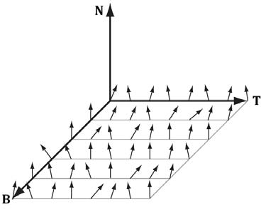
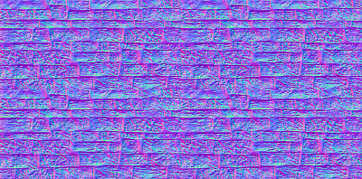
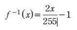
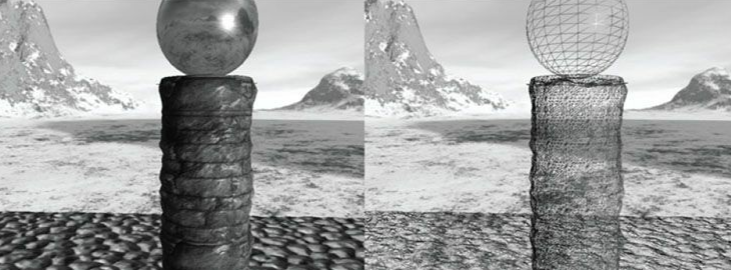
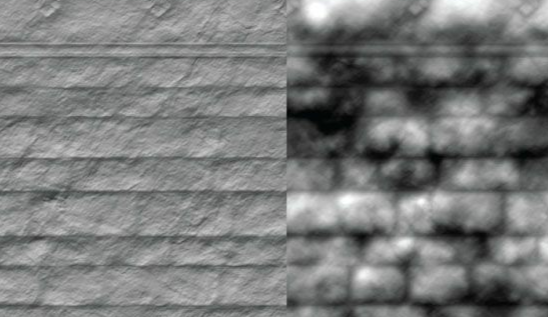
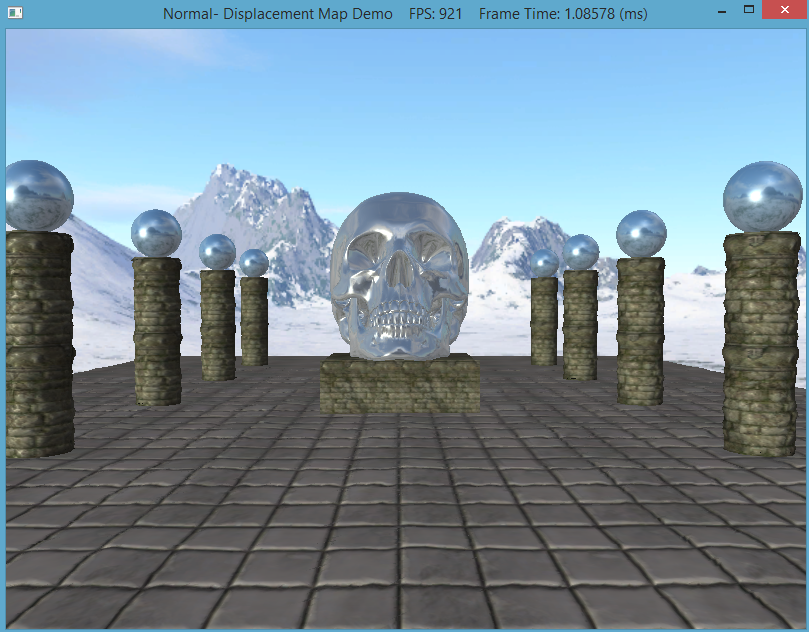

Previous texture mapping of objects simply leaves the object looking un-natural and not entirely realistic. This is because the underlying mesh geometry is smooth, and applying just an image of a bumpy material does not in fact make it appear that way. In order to change this to make it more realistic, we use normal mapping, or bump mapping, and displacement mapping to fake the lighting of bumps and dents to give an object and texture more depth. 

0. Getting Started
==================

Download [CS470\_Lab12-2.zip](src/CS470_Lab12-2.zip), saving it into the **labs** directory.

Double-click on **CS470\_Lab12-2.zip** and extract the contents of the archive into a subdirectory called **CS470\_Lab12-2**

Navigate into the **CS470\_Lab12-2** directory and double-click on **CS470\_Lab12-2.sln**.

1. Normal Maps
==============

A normal map is a texture, however, instead of storing RGB data at each texel, they are stored in a compressed x, y, and z coordinate, respectively, which stores a normal vector at each pixel.

> 
>
> 

Note: Normals stored in a normal map relative to a texture space coordinate system defined by vectors T (X-axis), B (Y-axis), and N (Z-axis). The z-coordinate has the largest magnitude because vectors are generally mostly aligned with the z-axis. This means normal maps will usually appear mostly blue because the z-coordinate is stored in the z channel. 

Unit vectors present us from properly representing colors; to do this, we need to compress each vector to a value between 0 and 255. Each coordinate in a unit vector is always between [-1, 1], so if we shift this range to [0,1], multiply by 255, and truncate the decimal, we are able to get this value. This is represented by the equation:

>	**f(x) =(0.5x + 0.5)\*255**

Instead, we can use the [CrazyBump](http://crazybump.com) program many people used in CS370 to generate our normal maps rather than doing the conversion ourselves. The inverse of the previous equation will uncompress the coordinates given by the normal map back to coordinates that lay between [-1,1].



The color vector **normalT** in the code below normalizes the r,g,b components so they are between 0 and 1, and then it is uncompressed again to make **normalT**'s components be between [-1,1] again.

Add the following code to **LightHelper.fx**

```cpp
// Uncompress each component from [0,1] to [-1,1].
float3 normalT = 2.0f*normalMapSample - 1.0f;
```

2.Initializing the Tangent space
================================

The tangent space is represented by a TBN-basis (X,Y,Z respectivly) where **N** is the surface normal, **B** is the binormal, and **T** is the tangent. Depending on where the surface normal, **N**, is pointing, the tangeant space will differ. This is because our normals aren't perpendicular to the texture, but instead the TBN is based off vertices instead of a face of the object.

We first need to compute **B = N x T** when **B** is needed rather than storing it in memory, and **N** is the usual averaged vertex normal. The vertex structure looks like the code below and should be added to **Vertex.h**:

```cpp
namespace Vertex
{
	// Basic 32-byte vertex structure.
	struct Basic32
	{
		XMFLOAT3 Pos;
		XMFLOAT3 Normal;
		XMFLOAT2 Tex;
	};

	struct PosNormalTexTan
	{
		XMFLOAT3 Pos;
		XMFLOAT3 Normal;
		XMFLOAT2 Tex;
		XMFLOAT3 TangentU;
	};
}
```

Then we need to declare tangent variables in **VertexIn** and **VertexOut** in **NormalMap.fx**:

```cpp
struct VertexIn
{
	float3 PosL     : POSITION;
	float3 NormalL  : NORMAL;
	float2 Tex      : TEXCOORD;
	float3 TangentL : TANGENT;
};

struct VertexOut
{
	float4 PosH     : SV_POSITION;
    float3 PosW     : POSITION;
    float3 NormalW  : NORMAL;
	float3 TangentW : TANGENT;
	float2 Tex      : TEXCOORD;
};
```

Lastly, we need to transform the vertex normal and tangent vector to the world space and output the results to the pixel shader.

```cpp
// Transform to world space space.
vout.PosW     = mul(float4(vin.PosL, 1.0f), gWorld).xyz;
vout.NormalW  = mul(vin.NormalL, (float3x3)	gWorldInvTranspose);
vout.TangentW = mul(vin.TangentL, (float3x3)gWorld);
```

3. Computing the Tangent space
==============================

Now that we have the coordinates of the TBN-basis relative to the object space coordinate system, we can now transform coordinates from tangent space to object space with a 3x3 orthogonal matrix. In order to do this, we build the TBN-bases at each pixel point on the surface of the triangle, which in turn transforms the sampled normal vector from the normal map from tangeant space to world space. The result can now be used for light calculations.

Add the following code to **LightHelper.fx**

```cpp
// Build orthonormal basis.
float3 N = unitNormalW;
float3 T = normalize(tangentW - dot(tangentW, N)*N);
float3 B = cross(N, T);

float3x3 TBN = float3x3(T, B, N);

// Transform from tangent space to world space.
float3 bumpedNormalW = mul(normalT, TBN);
```

4. Displacement Mapping
===================================

Normal Mapping as we just did above improves lighting detail to create more depth to textures. Displacement mapping takes that one step further by utilizing an additional map called a heightmap, which describes the bumps and crevices of a surface. A heightmap is essentially just a graysacale image where each pixel is interpreted as a height value. This is used when we tessellate a mesh, where the heightmap is sampled in the domain shader to offset vertices in the normal vector direction, which in turn, adds geometric detail. The following formula is used to displace a vertex position (p), where the outward surface normal vector (n) is used as the direction of displacement:
				
>    **P' = P + S(h-1)n**
	
This equation "pops" the geometry inward by using the **h** value that was obtained from the heightmap. 

> 

> 

First, we need to integrate displacement mapping into the rendering of the scene, meaning tessellation needs to be supported so the geometry resolution can match the displacement map. To do this, we need to add a case in which this can be executed which allows us to tessellate each triangle. Add the following code to **NormalDisplacementMapDemo.cpp**:

```cpp
case RenderOptionsDisplacementMap:
	activeTech = Effects::DisplacementMapFX->Light3TexTech;
	md3dImmediateContext->IASetPrimitiveTopology(D3D11_PRIMITIVE_TOPOLOGY_3_CONTROL_POINT_PATCHLIST);
	break;
```

5. Displacement Map Vertex Shader
===================================

Each triangle has to be tessellated differently depending on how close or far it is to the eye. the closer it is, the more tessellation it recieves, and vice versa. The vertex shader helps compute a distance to determine this amount, which is then passed onto the hull shader. Add the following code to **DisplacementMap.fx** which creates a linear function of distance that determines how much to tessellate based on distance of triangle.

```cpp
float gMaxTessDistance;
	float gMinTessDistance;
	float gMinTessFactor;
	float gMaxTessFactor;

....

struct VertexIn
{
	float3 PosL     : POSITION;
	float3 NormalL  : NORMAL;
	float2 Tex      : TEXCOORD;
	float3 TangentL : TANGENT;
};

struct VertexOut
{
    float3 PosW       : POSITION;
    float3 NormalW    : NORMAL;
	float3 TangentW   : TANGENT;
	float2 Tex        : TEXCOORD;
	float  TessFactor : TESS;
};

VertexOut VS(VertexIn vin)
{
	VertexOut vout;

	// Transform to world space space.
	vout.PosW     = mul(float4(vin.PosL, 1.0f), gWorld).xyz;
	vout.NormalW  = mul(vin.NormalL, (float3x3)gWorldInvTranspose);
	vout.TangentW = mul(vin.TangentL, (float3x3)gWorld);

	// Output vertex attributes for interpolation across triangle.
	vout.Tex = mul(float4(vin.Tex, 0.0f, 1.0f), gTexTransform).xy;
	
	float d = distance(vout.PosW, gEyePosW);

	// Normalized tessellation factor. 
	// The tessellation is 
	//   0 if d >= gMinTessDistance and
	//   1 if d <= gMaxTessDistance.  
	float tess = saturate( (gMinTessDistance - d) / (gMinTessDistance - gMaxTessDistance) );
	
	// Rescale [0,1] --> [gMinTessFactor, gMaxTessFactor].
	vout.TessFactor = gMinTessFactor + tess*(gMaxTessFactor-gMinTessFactor);

	return vout;
}
```

6. Displacement Map Hull Shader
===============================

The constant hull shader is tasked with outputting the tessellation factors of the mesh, which then instruct the tessellation stage how much to tessellate the current patch. 
The tessellation factors are computed by averaging the vertex tessellation factors, however, we have to be careful because if two adjacent triangles had different tessellation factors, their edges would also, meaning this could lead to cracks after displacement mapping. Add the following code to **DisplacementMap.fx** to compute these:

```cpp
struct PatchTess
{
	float EdgeTess[3] : SV_TessFactor;
	float InsideTess  : SV_InsideTessFactor;
};

PatchTess PatchHS(InputPatch<VertexOut,3> patch, 
                  uint patchID : SV_PrimitiveID)
{
	PatchTess pt;
	
	// Average tess factors along edges, and pick an edge tess factor for 
	// the interior tessellation.  It is important to do the tess factor
	// calculation based on the edge properties so that edges shared by 
	// more than one triangle will have the same tessellation factor.  
	// Otherwise, gaps can appear.
	pt.EdgeTess[0] = 0.5f*(patch[1].TessFactor + patch[2].TessFactor);
	pt.EdgeTess[1] = 0.5f*(patch[2].TessFactor + patch[0].TessFactor);
	pt.EdgeTess[2] = 0.5f*(patch[0].TessFactor + patch[1].TessFactor);
	pt.InsideTess  = pt.EdgeTess[0];
	
	return pt;
}
```

7. Displacement Map Domain Shader
===================================

The domain shader takes inputs of the hull shader outputs, patch data, and tessellation factors, and it outputs the position of a vertex. It samples the heightmap and offsets the vertices in the normal direction, and is called for every vertex created by the tessellator. Add the following code to support the domain shader within the **DisplacementMap.fx** file:

```cpp
struct DomainOut
{
	float4 PosH     : SV_POSITION;
     float3 PosW     : POSITION;
     float3 NormalW  : NORMAL;
	float3 TangentW : TANGENT;
	float2 Tex      : TEXCOORD;
};

// The domain shader is called for every vertex created by the tessellator.  
// It is like the vertex shader after tessellation.
[domain("tri")]
DomainOut DS(PatchTess patchTess, 
             float3 bary : SV_DomainLocation, 
             const OutputPatch<HullOut,3> tri)
{
	DomainOut dout;
	
	// Interpolate patch attributes to generated vertices.
	dout.PosW     = bary.x*tri[0].PosW     + bary.y*tri[1].PosW     + bary.z*tri[2].PosW;
	dout.NormalW  = bary.x*tri[0].NormalW  + bary.y*tri[1].NormalW  + bary.z*tri[2].NormalW;
	dout.TangentW = bary.x*tri[0].TangentW + bary.y*tri[1].TangentW + bary.z*tri[2].TangentW;
	dout.Tex      = bary.x*tri[0].Tex      + bary.y*tri[1].Tex      + bary.z*tri[2].Tex;
	
	// Interpolating normal can unnormalize it, so normalize it.
	dout.NormalW = normalize(dout.NormalW);
	
	//
	// Displacement mapping.
	//
	
	// Choose the mipmap level based on distance to the eye; specifically, choose
	// the next miplevel every MipInterval units, and clamp the miplevel in [0,6].
	const float MipInterval = 20.0f;
	float mipLevel = clamp( (distance(dout.PosW, gEyePosW) - MipInterval) / MipInterval, 0.0f, 6.0f);
	
	// Sample height map (stored in alpha channel).
	float h = gNormalMap.SampleLevel(samLinear, dout.Tex, mipLevel).a;
	
	// Offset vertex along normal.
	dout.PosW += (gHeightScale*(h-1.0))*dout.NormalW;
	
	// Project to homogeneous clip space.
	dout.PosH = mul(float4(dout.PosW, 1.0f), gViewProj);
	
	return dout;
}
```

8. Compiling and running the program
====================================

Once you have completed typing in the code, you can build and run the program in one of two ways:

> -   Click the small green arrow in the middle of the top toolbar
> -   Hit F5 (or Ctrl-F5)

The output should look similar to below

> 

Hold '1' for wireframe mode, '2' for basic rendering, '3' for normal mapped rendering, and '4' for displaced mapped rendering.
To quit the program simply smash your face into the keyboard or throw it on the ground.


