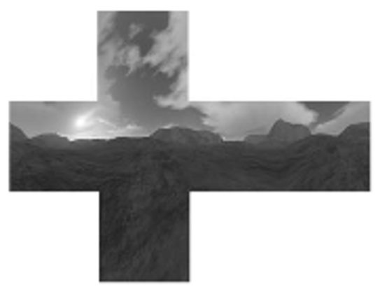
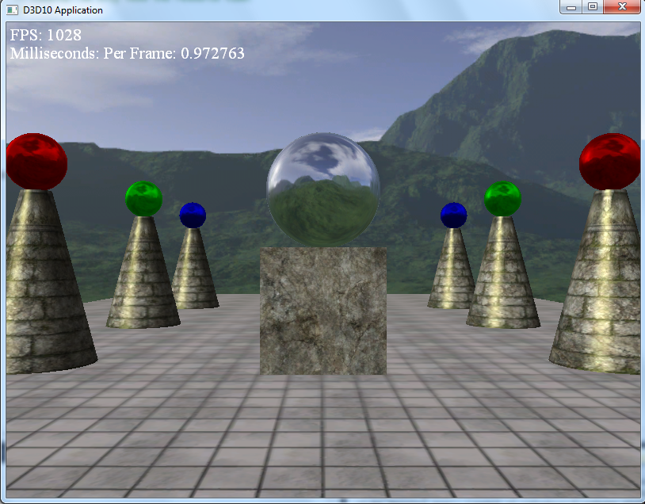

Outdoor environment scenes are just as important as indoor scenes. Thinking outside the box can mean developing a world to walk around in and explore with many different elements that mimic the real world.

0. Overview
===========

A cube map is exactly what it sounds like - it is a series of six textures collected and stitched together to form the shape of a cube, which gives the illusion of being immersed in an environment. It is very similar to standard texture maps, which we covered in CS370, in that you are essentially texture mapping six faces of a cube.

1. Getting Started
==================

Download [CS470\_Lab12.zip](src/CS470_Lab12.zip), saving it into the **labs** directory.

Double-click on **CS470\_Lab12.zip** and extract the contents of the archive into a subdirectory called **CS470\_Lab12**

Navigate into the **CS470\_Lab12** directory and double-click on **CS470\_Lab12.sln**.

If the **Header Files**, **Resource Files** and **Source Files** folders in the **Solution Explorer** pane are not expanded, expand each by double clicking on them and double-click on **Sky.h**, **Sky.cpp**, **TextureMgr.h**, **TextureMgr.cpp** and **sky.fx**.


2. Loading a cube map
=====================

A cube map is essentially a different type of texture map. It is stored similarly to a texture array with six elements each labeled to a different axis: +Y, -Y, +X, -X, +Z, and -Z. Aligning the sides of the cube to the axis makes it easier keep track of what side is pointing where.

Loading a cube map into your code is similar to loading in a regular texture. In this case, however, you must specify that the texture is a cube map so it will be loaded properly. The view also needs to be informed that the texture is a cube map so it will display properly. An  example cube map looks like

> 

The following code loads and uses the cube maps in Direct3D; An ID3D11Texture2D object stores the six textures of the cube map as a texture array, then an ID3D11ShaderResourceView* is obtained and set to a TextureCube variable with this method:

```cpp
//.fx variable
TextureCube gCubemap;
```

```cpp
//.cpp code
ID3DX11EffectShaderResourceVariable* CubeMap;

CubeMap = mFX->GetVariableByName("gCubeMap")->	AsShaderResource();
...
CubeMap->SetResource(cubemap);
```

3. Creating a sky
=================

Creating a sky scene is one of the most important uses of cobe mapping. This allows for the user to be looking at an entire scene or environment rather than empty space. Sky areas and environment maps are created by rendering an object that encompasses an entire scene and using the cube map to texture it. The object used to create a sky is an ellipsoid as it will create the most convincing sky appearance. We assume the ellipsoid is infinitely far away so that no matter how the camera moves through the world, we never appear to be further or closer to the sky. To do this, the ellipsoid is centered about the camera. This simulates the sky being infinitely far away. 

Double-click **Sky.fx** which contains the structure to build your geometry that your cube map will be mapped to. Add the following code to sky.fx which contains variables for the cube map resource view as well as the shader variables which will help create the illusion of a sky.

```
cbuffer cbPerFrame
{
	float4x4 gWorldViewProj;
};
 
// Nonnumeric values cannot be added to a cbuffer.
TextureCube gCubeMap;

SamplerState samTriLinearSam
{
	Filter = MIN_MAG_MIP_LINEAR;
	AddressU = Wrap;
	AddressV = Wrap;
};

struct VertexIn
{
	float3 PosL : POSITION;
};

struct VertexOut
{
	float4 PosH : SV_POSITION;
    float3 PosL : POSITION;
};
 
VertexOut VS(VertexIn vin)
{
	VertexOut vout;
	
	// Set z = w so that z/w = 1 (i.e., skydome always on far plane).
	vout.PosH = mul(float4(vin.PosL, 1.0f), gWorldViewProj).xyww;
	
	// Use local vertex position as cubemap lookup vector.
	vout.PosL = vin.PosL;
	
	return vout;
}

float4 PS(VertexOut pin) : SV_Target
{
	return gCubeMap.Sample(samTriLinearSam, pin.PosL);
}

RasterizerState NoCull
{
    CullMode = None;
};

DepthStencilState LessEqualDSS
{
	// Make sure the depth function is LESS_EQUAL and not just LESS.  
	// Otherwise, the normalized depth values at z = 1 (NDC) will 
	// fail the depth test if the depth buffer was cleared to 1.
    DepthFunc = LESS_EQUAL;
};

technique11 SkyTech
{
    pass P0
    {
        SetVertexShader( CompileShader( vs_5_0, VS() ) );
        SetGeometryShader( NULL );
        SetPixelShader( CompileShader( ps_5_0, PS() ) );
        
        SetRasterizerState(NoCull);
        SetDepthStencilState(LessEqualDSS, 0);
    }
}
```

The texture coordinates that correspond to the verticies are copies of them, meaning in the shader above, you only need to texture map the sphere onto the object. The sky also has to be as far away from the viewer as possible, again, to ensure the illusion of a neverending sky. This is done by placing the sky object on the far clipping plane. The following code inserted above demonstrates how this is accomplished to where the sky is far enough away and doesn't appear as the ellipsoid that it actually is.

```cpp
// Set z = w so that z/w = 1 (i.e., skydome always on far plane).
vout.PosH = mul(float4(vin.PosL, 1.0f), gWorldViewProj).xyww;

// Use local vertex position as cubemap lookup vector.
vout.PosL = vin.PosL;
```

Last but not least, now that the sky is on the far clipping plane, the standard depth test has to be set to LESS_EQUAL so the sky object in the shader does not fail when rendered. 

```cpp
DepthStencilState LessEqualDSS
{
	// Make sure the depth function is LESS_EQUAL and not just LESS.  
	// Otherwise, the normalized depth values at z = 1 (NDC) will 
	// fail the depth test if the depth buffer was cleared to 1.
    DepthFunc = LESS_EQUAL;
};
```

It should also be noted that in these applications, the sky should always be drawn last; this is because if drawn first, resources are being wasted from drawing pixels that will simply be overwritten by other geometry that is closer to the camera. 
 
4. Environment mapping to create reflections
============================================

Aside from simulating a sky or background scene, we can also use this environment mapping to create reflections on objects throughout the scene. The surface of the object acts as a mirror, where the eye looks at p and sees the environment reflected off p. The lighting equation is modified to include a reflection term which handles the pixel's color with the following code which can be added to **Basic.fx**: 

```cpp
litColor = texColor*(ambient + diffuse) + spec;

if( gReflectionEnabled )
{
	float3 incident = -toEye;
	float3 reflectionVector = reflect(incident, pin.NormalW);
	float4 reflectionColor  = gCubeMap.Sample(samAnisotropic, reflectionVector);

	litColor += gMaterial.Reflect*reflectionColor;
}
```

The one issue that arises with this is that there may be oversaturation caused by the addition of a reflection term and more color. This needs to be balanced out by scaling down the ambient and diffuse material factors so that less ambient and diffuse light are reflected off the surface. One way this is done is by using the equation 

**f = tcr + (1 - t)s** for **0<=t<=1**

In this case, the colors taken from the environment map are added in with a weight, t, and then we equally take color from the usual lit pixed to maintain the balance necessary. In this equation, t controls reflectivity of the surface. For example, A perfect reflective mirror would have a t value of (1, 1, 1, 1), while a surface with no reflection at all would have a t value of (0, 0, 0, 0).

The one minor setback is that reflectivity does not work so well on flat surfaces; this is because the reflection vector has no starting position meaning two of them pointing in the same direction can sample the same texel. In turn, this creates an issue when they are both mapped to the same place. Curvy surfaces don't have the same issue because the reflection vector varies. 

5. Compiling and running the program
====================================

Once you have completed typing in the code, you can build and run the program in one of two ways:

> -   Click the small green arrow in the middle of the top toolbar
> -   Hit **F5** (or **Ctrl-F5**)

The output should look similar to below

> 

To quit the program simply close the window.

As you move around in the program, you'll notice the background never gets any closer or further, and the spheres will only reflect the background.

6. Creating your own Cube Maps
==============================

Creating your own texture is fairly simple using the built in DirectX Texture Tool. To do so, first navigate to your DirectX Texture Tool Application. Then:

> 1.  Go to File -\> New Texture
> 2.  In the texture type, click on cube map texture
> 3.  click OK

The empty cube map is now ready for images. To change the current face you are on, go to **View -> Cube Map Face** and click on the face you want to view. The faces are labeled as follows:

> Positive X -\> right face
>
> Negative X -\> left face
>
> Positive Y -\> top face
>
> Negative Y -\> bottom face
>
> Positive Z -\> front face
>
> Negative Z -\> back face

To load an image onto a cube map face, go to **File -> Open Onto This Cubemap Face**

From there, save the file to your Textures folder in your lab, and simply replace the filename in your project to the one you want loaded in. 

