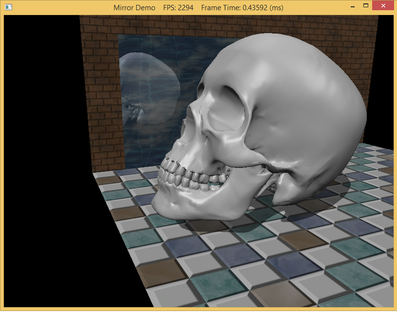

The stencil buffer is an off-screen buffer we can use to achieve special effects. The stencil buffer has the same resolution as the back buffer and depth buffer, such that the ijth pixel in the stencil buffer corresponds with the ij-th pixel in the back buffer and depth buffer. The stencil buffer works as a stencil and allows us to block the rendering of certain pixel fragments to the back buffer.

0. Getting Started
==================

Download [CS470\_Lab13-2.zip](src/CS470\_Lab13-2.zip), saving it into the **labs** directory.

Double-click on **CS470\_Lab13-2.zip** and extract the contents of the archive into a subdirectory called **CS470\Stenciling**

Navigate into the **CS470\_Lab13-2** directory and double-click on **CS470\_Lab13-2.sln**.

If the **Header Files**, **Resource Files** and **Source Files** folders in the **Solution Explorer** pane are not expanded, expand each by double clicking on them and double-click on **MirrorDemo.cpp** and **RenderStates.cpp**.

1. Stencil Test
===============

We can use the stencil buffer to block rendering to certain areas of the back buffer. The decision to block a particular pixel from being written is decided by the stencil test, which is given by the following:

```cpp
if(StencilRef & StencilReadMask ? Value & StencilReadMask)

  accept pixel

else

  reject pixel
```

The ? can be replaced by the operation that you want, explained further below.

1. A left-hand-side (LHS) operand that is determined by ANDing an application-defined stencil reference value (StencilRef) with an application-defined masking value (StencilReadMask).

2. A right-hand-side (RHS) operand that is determined by ANDing the entry already in the stencil buffer of the particular pixel we are testing (Value) with an application-defined masking value (StencilReadMask).

```cpp
typedef enum D3D11_COMPARISON_FUNC
{
    D3D11_COMPARISON_NEVER = 1,
    D3D11_COMPARISON_LESS = 2,
    D3D11_COMPARISON_EQUAL = 3,
    D3D11_COMPARISON_LESS_EQUAL = 4,
    D3D11_COMPARISON_GREATER = 5,
    D3D11_COMPARISON_NOT_EQUAL = 6,
    D3D11_COMPARISON_GREATER_EQUAL = 7,
    D3D11_COMPARISON_ALWAYS = 8,
} D3D11_COMPARISON_FUNC;
```

Here are the explanations for each of the enumeration values:

1. D3D11_COMPARISON_NEVER: The function always returns false.

2. D3D11_COMPARISON_LESS: Replace ? with the < operator.

3. D3D11_COMPARISON_EQUAL: Replace ? with the == operator.

4. D3D11_COMPARISON_LESS_EQUAL: Replace ? with the = operator.

5. D3D11_COMPARISON_GREATER: Replace ? with the > operator.

6. D3D11_COMPARISON_NOT_EQUAL: Replace ? with the ! = operator.

7. D3D11_COMPARISON_GREATER_EQUAL: Replace ? with the = operator.

8. D3D11_COMPARISON_ALWAYS: The function always returns true.

2. Depth Settings
=================

We also need to control the depth buffer to make sure the reflected skull is rendered properly.

1. DepthEnable: Specify true to enable the depth buffering; specify false to disable it. When depth testing is disabled, the draw order matters, and a pixel fragment will be drawn even if it is behind an occluding object (review §4.1.5, do it). If depth buffering is disabled, elements in the depth buffer are not updated either, regardless of the DepthWriteMask

2. DepthWriteMask: This can be either D3D11_DEPTH_WRITE_MASK_ZERO or D3D11_DEPTH_WRITE_MASK_ALL, but not both. Assuming DepthEnable is set to true, D3D11_DEPTH_WRITE_MASK_ZERO disables writes to the depth buffer, but depth testing will still occur. D3D11_DEPTH_WRITE_MASK_ALL enables writes to the depth buffer; new depths will be written provided the depth and stencil test both pass. The ability to control depth reads and writes becomes necessary for implementing certain special effects.

3. DepthFunc: Specify one of the members of the D3D11_COMPARISON_FUNC enumerated type to define the depth test comparison function. Usually this is always D3D11_COMPARISON_LESS so that the usual depth test is performed, as described in §4.1.5. That is, a pixel fragment is accepted provided its depth value is less than the depth of the previous pixel written to the back buffer. But as you can see, Direct3D allows you to customize the depth test if necessary.

3. Depth/Stencil States in Effect Files
=======================================

A depth/stencil state can also be directly defined and set in an effect file:

```cpp
DepthStencilState DSS
{
    DepthEnable = true;
    DepthWriteMask = Zero;
    StencilEnable = true;
    StencilReadMask = 0xff;
    StencilWriteMask = 0xff;
    FrontFaceStencilFunc = Always;
    FrontFaceStencilPass = Incr;
    FrontFaceStencilFail = Keep;
    BackFaceStencilFunc = Always;
    BackFaceStencilPass = Incr;
    BackFaceStencilFail = Keep;
};

...

technique11 Tech
{
  pass P0
  {
    SetVertexShader(CompileShader(vs_5_0, VS()));
    SetGeometryShader(NULL);
    SetPixelShader(CompileShader(ps_5_0, PS()));
    SetDepthStencilState(DSS, 0);
  }
}
```

The values you assign to the depth/stencil state object are like those you assign to the C++ structure, except without the prefix.

For example, instead of specifying **D3D11_STENCIL_OP_INCR** we just specify **INCR** in the effect code. Incidentally, the state values we specify are not case sensitive, so, for example, INCR is equivalent to Incr.

4. Mirror Overview
==================

To render a mirror we will make use of the Back Buffer, Stencil Buffer, and the Depth Buffer. As usual the back buffer will contain what will be rendered on the screen when we alternate buffers. We will render the mirror to the Stencil Buffer and use the Stencil Test to determine what part of the reflected skull object will be displayed. Finally, we wil use the depth buffer to NOT display parts of the skull that would appear behind the wall.

Again, here are the steps we will follow (in a more detailed explanation):

1. Render the floor, walls, and skull to the back buffer as normal (but not the mirror). Note that this step does not modify the stencil buffer.

2. Clear the stencil buffer to 0. 

3. Render the mirror only to the stencil buffer. We can disable color writes to the back buffer by creating a blend state that sets.

	To make sure we only render parts of the skull into the mirror, when we write the mirror to the stencil buffer we make sure to set the value to 1 each time. This way when we begin to render the reflected skull we can ask the stencil test to only pass through the part of the skull that will show in the mirror (the part that equals 1 in the stencil test).

	Again, When rendering the mirror to the stencil buffer, we set the stencil test to always succeed (D3D11_COMPARISON_ALWAYS) and specify that the stencil buffer entry should be replaced (D3D11_STENCIL_OP_REPLACE) with 1 (StencilRef) if the test passes.

4. Now we render the reflected skull to the back buffer and stencil buffer. But recall that we only will render to the back buffer if the stencil test passes. This time, we set the stencil test to only succeed if the value in the stencil buffer equals 1; this is done using a StencilRef of 1, and the stencil operator D3D11_COMPARISON_EQUAL. In this way, the reflected skull will only be rendered to areas that have a 1 in their corresponding stencil buffer entry. Because the areas in the stencil buffer that correspond to the visible parts of the mirror are the only entries that have a 1, it follows that the reflected skull will only be rendered into the visible parts of the mirror.

5. Finally, we render the mirror to the back buffer as normal. However, in order for the skull reflection to show through (which lies behind the mirror), we need to render the mirror with transparency blending. If we did not render the mirror with transparency, the mirror would simply occlude the reflection because its depth is less than that of the reflection. To implement this, we simply need to define a new material instance for the mirror; we set the alpha channel of the diffuse component to 0.5 to make the mirror 50% opaque, and we render the mirror with the transparency blend state as described in the last chapter (§9.5.4).

```cpp
mMirrorMat.Ambient = XMFLOAT4(0.5f, 0.5f, 0.5f, 1.0f);
mMirrorMat.Diffuse = XMFLOAT4(1.0f, 1.0f, 1.0f, 0.5f);
mMirrorMat.Specular = XMFLOAT4(0.4f, 0.4f, 0.4f, 16.0f);
```

These settings give the following blending equation:

>    **C = 0.5 · Csrc + 0.5 · Cdst**

Assuming we have laid down the reflected skull pixels to the back buffer, we see 50% of the color comes from the mirror (source) and 50% of the color comes from the skull (destination).

5. Setting up the Depth and Stencil States
==========================================

The code to implement this algorithm will require two depth and stencil states. One to manage writing the mirror data to the stencil buffer and the other is to make sure the skull is only rendered to the parts of the mirror that are visible.

UNCOMMENT THIS CODE IN **RenderStates.cpp**

```cpp
//
// MarkMirrorDSS
//
D3D11_DEPTH_STENCIL_DESC mirrorDesc;
mirrorDesc.DepthEnable = true;
mirrorDesc.DepthWriteMask = D3D11_DEPTH_WRITE_MASK_ZERO;
mirrorDesc.DepthFunc = D3D11_COMPARISON_LESS;
mirrorDesc.StencilEnable = true;
mirrorDesc.StencilReadMask = 0xff;
mirrorDesc.StencilWriteMask = 0xff;
mirrorDesc.FrontFace.StencilFailOp = D3D11_STENCIL_OP_KEEP;
mirrorDesc.FrontFace.StencilDepthFailOp = D3D11_STENCIL_OP_KEEP;
mirrorDesc.FrontFace.StencilPassOp = D3D11_STENCIL_OP_REPLACE;
mirrorDesc.FrontFace.StencilFunc = D3D11_COMPARISON_ALWAYS;

// We are not rendering backfacing polygons, so these settings do not matter.
mirrorDesc.BackFace.StencilFailOp = D3D11_STENCIL_OP_KEEP;
mirrorDesc.BackFace.StencilDepthFailOp = D3D11_STENCIL_OP_KEEP;
mirrorDesc.BackFace.StencilPassOp = D3D11_STENCIL_OP_REPLACE;
mirrorDesc.BackFace.StencilFunc = D3D11_COMPARISON_ALWAYS;
ID3D11DepthStencilState* MarkMirrorDSS;
HR(device->CreateDepthStencilState(&mirrorDesc, &MarkMirrorDSS));

//
// DrawReflectionDSS
//
D3D11_DEPTH_STENCIL_DESC drawReflectionDesc;
drawReflectionDesc.DepthEnable = true;
drawReflectionDesc.DepthWriteMask = D3D11_DEPTH_WRITE_MASK_ALL;
drawReflectionDesc.DepthFunc = D3D11_COMPARISON_LESS;
drawReflectionDesc.StencilEnable = true;
drawReflectionDesc.StencilReadMask = 0xff;
drawReflectionDesc.StencilWriteMask = 0xff;
drawReflectionDesc.FrontFace.StencilFailOp = D3D11_STENCIL_OP_KEEP;
drawReflectionDesc.FrontFace.StencilDepthFailOp = D3D11_STENCIL_OP_KEEP;
drawReflectionDesc.FrontFace.StencilPassOp = D3D11_STENCIL_OP_KEEP;
drawReflectionDesc.FrontFace.StencilFunc = D3D11_COMPARISON_EQUAL;

// We are not rendering backfacing polygons, so these settings do not matter.
drawReflectionDesc.BackFace.StencilFailOp = D3D11_STENCIL_OP_KEEP;
drawReflectionDesc.BackFace.StencilDepthFailOp = D3D11_STENCIL_OP_KEEP;
drawReflectionDesc.BackFace.StencilPassOp = D3D11_STENCIL_OP_KEEP;
drawReflectionDesc.BackFace.StencilFunc = D3D11_COMPARISON_EQUAL;
ID3D11DepthStencilState* DrawReflectionDSS;
HR(device->CreateDepthStencilState(&drawReflectionDesc, &DrawReflectionDSS));
```

6. Drawing the scene!
=====================

The following code outlines our draw method. We have omitted irrelevant details, such as setting constant buffer values, for brevity and clarity (see the project code for the full details).

READ THROUGH THE DRAW SCENE METHOD TO FIND CODE TO UNCOMMENT

```cpp
//
// Draw the floor, walls and skull to the back buffer as normal.
//

...

//
// Draw the mirror to the stencil buffer.
// Here we set the stencil value of visible pixels of the mirror
// to 1, thereby marking “mirror pixels.”
//
// Note that we have to draw the mirror last because we need to
// render the skull into the depth buffer first so that when we
// render the mirror, portions of the mirror that are occluded
// by the skull fail the depth test and do not get rendered
// into the stencil buffer. We do not want to set pixels on
// the stencil buffer that are occluded. Otherwise the reflection
// will show through the skull, too.
//
// Do not write to render target.
md3dImmediateContext->OMSetBlendState(RenderStates::NoRenderTargetWritesBS, blendFactor, 0xffffffff);

// Render visible mirror pixels to stencil buffer.
// Do not write mirror depth to depth buffer at this point, otherwise
// it will occlude the reflection.
md3dImmediateContext->OMSetDepthStencilState(RenderStates::MarkMirrorDSS, 1);
pass->Apply(0, md3dImmediateContext);

// Draw mirror.
md3dImmediateContext->Draw(6, 24);

//
// Draw the reflected skull.
//
// Build reflection matrix to reflect the skull.
XMVECTOR mirrorPlane = XMVectorSet(0.0f, 0.0f, 1.0f, 0.0f); // xy plane
XMMATRIX R = XMMatrixReflect(mirrorPlane);
XMMATRIX world = XMLoadFloat4x4(&mSkullWorld) * R;

...

// Reflect the light source as well.
// Cache the old light directions, and reflect the light directions.
XMFLOAT3 oldLightDirections[3];
for(int i = 0; i < 3; ++i)
{
  oldLightDirections[i] = mDirLights[i].Direction;
  XMVECTOR lightDir = XMLoadFloat3(&mDirLights[i].Direction);
  XMVECTOR reflectedLightDir = XMVector3TransformNormal(lightDir, R);
  XMStoreFloat3(&mDirLights[i].Direction, reflectedLightDir);
}
Effects::BasicFX->SetDirLights(mDirLights);

// Reflection changes winding order, so cull clockwise
// triangles instead (see §10.4.4).
md3dImmediateContext->RSSetState(RenderStates::CullClockwiseRS);

// Only render reflection to pixels with a stencil value equal to 1. Only
// visible mirror pixels have a stencil value of 1, hence the skull
// will only be rendered into the mirror.
md3dImmediateContext->OMSetDepthStencilState(RenderStates::DrawReflectionDSS, 1);
pass->Apply(0, md3dImmediateContext);
md3dImmediateContext->DrawIndexed(mSkullIndexCount, 0, 0);

// Restore default states.
md3dImmediateContext->RSSetState(0);
md3dImmediateContext->OMSetDepthStencilState(0, 0);

// Restore light directions.
for(int i = 0; i < 3; ++i)
{
  mDirLights[i].Direction = oldLightDirections[i];
}
Effects::BasicFX->SetDirLights(mDirLights);

//
// Draw the mirror to the back buffer as usual but with transparency
// blending so the reflection shows through.
//
// Mirror
md3dImmediateContext->OMSetBlendState(RenderStates::TransparentBS, blendFactor, 0xffffffff);
pass->Apply(0, md3dImmediateContext);
md3dImmediateContext->Draw(6, 24);
```

7. Winding Order and Rotation
=============================

One thing we need to fix is the winding order and reversal of face normals of the triangles when they are reflected across a plane (as is the case with our reflected skull).

To correct this, we tell Direct3D to interpret triangles with a counterclockwise winding order as front facing and triangles with a clockwise winding order as back facing (this is the opposite of our usual convention—§5.10.2, have you read it?). This effectively reflects the normal directions so that they are outward facing after reflection. We reverse the winding order convention by setting the following rasterizer state:

```cpp
// Note: Define such that we still cull backfaces by making front faces CCW.
// If we did not cull backfaces, then we have to worry about the BackFace
// property in the D3D11_DEPTH_STENCIL_DESC.
D3D11_RASTERIZER_DESC cullClockwiseDesc;
ZeroMemory(&cullClockwiseDesc, sizeof(D3D11_RASTERIZER_DESC));
cullClockwiseDesc.FillMode = D3D11_FILL_SOLID;
cullClockwiseDesc.CullMode = D3D11_CULL_BACK;
cullClockwiseDesc.FrontCounterClockwise = true;
cullClockwiseDesc.DepthClipEnable = true;
ID3D11RasterizerState* CullClockwiseRS;
HR(device->CreateRasterizerState(&cullClockwiseDesc, &CullClockwiseRS));
```

8. Compiling and Running the Program (...PROFIT!)
=================================================
Once you have completed typing in the code, you can build and run the program in one of two ways:

> -   Click the small green arrow in the middle of the top toolbar
> -   Hit **F5** (or **Ctrl-F5**)

The output should look similar to below

> 

To quit the program simply close the window.

```cpp
// Controls:
//		Hold the left mouse button down and move the mouse to rotate.
//      Hold the right mouse button down to zoom in and out.
//
//      Press '1' - Lighting only render mode.
//      Press '2' - Texture render mode.
//      Press '3' - Fog render mode.
//
//		Move the skull left/right/up/down with 'A'/'D'/'W'/'S' keys.
```

To quit the program simply close the window.


