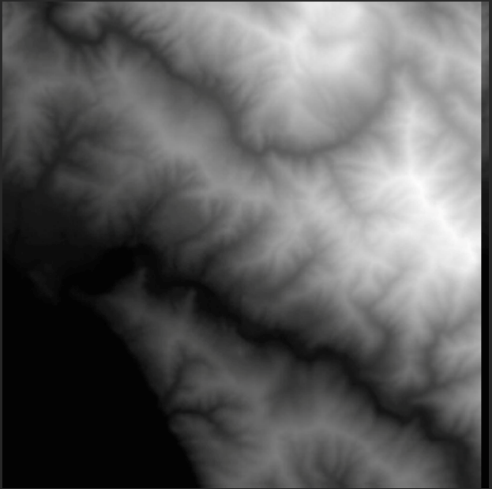
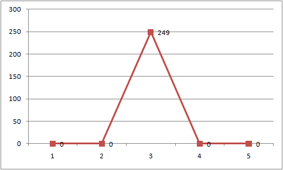
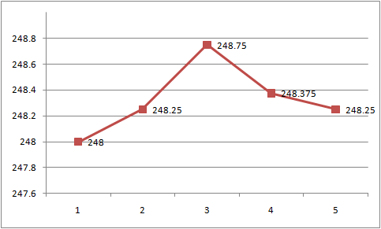
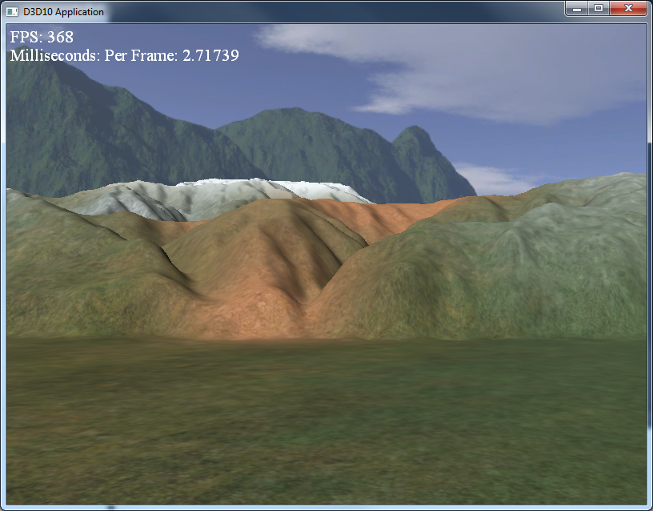

This is Terrain Rendering. This technique creates bumpy, hilly landscapes or objects as seen in some of the previous labs with the mountains. Like Dr. Babcock said, surprise surprise, it really is not that interesting... yet (*cough* next lecture *cough*).

0. Getting Started
==================

Download [CS470\_Lab13.zip](src/CS470\_Lab13.zip), saving it into the **labs** directory.

Double-click on **CS470\_Lab13.zip** and extract the contents of the archive into a subdirectory called **CS470\_Lab13**

Navigate into the **CS470\_Lab13** directory and double-click on **CS470\_Lab13.sln**.


1. HeightMaps
=============

Heightmaps are used to illustrate the differences in elevation of our terrain. A heightmap is a matrix of values with each value representing the individual height of a vertex in a grid of verticies in our application.

Heightmaps are graphically represented by a grayscale image. Black (RGB:0,0,0) represent the lowest areas on a terrain map, while white areas(RGB:1,1,1) represent the highest points of elevation. The grays represent varying heights inbetween. Below is an example of a heightmap:

> 

In this lab we will use a RAW image type although you can use any image format available to you. The RAW format is being used due to the ease of loading RAW data into our program. An 8-bit RAW file can hold 256 possible ranges of heights. If a 16-bit RAW file is used we can then represent 65536 ranges. In this lab we use an 8-bit RAW file.

Generating RAW files
--------------------

To generate RAW files you can use [Adobe Photoshop](https://www.adobe.com/cfusion/tdrc/index.cfm?product=photoshop) and [Corel PaintShop](http://www.corel.com/servlet/Satellite/us/en/Product/1208530085925#versionTabview=tab1&tabview=tab7) to simply draw your height maps. Terragen, Byrce and Dark Tree allow you to create height maps procedurally. Double-click **Mesh.h** which should have a skeleton structure already in the file with the method prototypes already in place including getter/setter methods and a copy constructor.

2. Loading a RAW file
=====================

Because a RAW file is nothing more than a contiguous block of bytes (where each byte is a heightmap entry), we can easily read in the block of memory with one std::ifstream::read call, as is done in this next method:

```cpp
void Terrain::LoadHeightmap() { 
  
  // A height for each vertex 
  std::vector<unsigned char> in(
  mInfo.HeightmapWidth * mInfo.HeightmapHeight);
  
  // Open the file.
  std::ifstream inFile;
  inFile.open(mInfo.HeightMapFilename.c_str(), std::ios_base::binary);
  
  if(inFile) { 
    // Read the RAW bytes. 
    inFile.read((char*)&in[0], (std::streamsize)in.size()); 
    // Done with file.
    inFile.close();
  }
  
  // Copy the array data into a float array and scale it. 
  mHeightmap.resize(mInfo.HeightmapHeight * mInfo.HeightmapWidth, 0); 
  
  for(UINT i = 0; i < mInfo.HeightmapHeight * mInfo.HeightmapWidth; ++i) { 
    mHeightmap[i] = (in[i] / 255.0f)*mInfo.HeightScale; 
  }

} 
```

The mInfo variable, a member of the Terrain class, is an instance of the following structure which describes various properties of the terrain:


```cpp
struct InitInfo { 
  
  // Filename of RAW heightmap data. 
  std::wstring HeightMapFilename; 
  
  // Texture filenames used for texturing the terrain. 
  std::wstring LayerMapFilename0; 
  std::wstring LayerMapFilename1; 
  std::wstring LayerMapFilename2; 
  std::wstring LayerMapFilename3; 
  std::wstring LayerMapFilename4; 
  std::wstring BlendMapFilename; 
  
  // Scale to apply to heights after they have been 
  // loaded from the heightmap. 
  float HeightScale; 
  
  // Dimensions of the heightmap. 
  UINT HeightmapWidth; 
  UINT HeightmapHeight; 
  
  // The cell spacing along the x- and z-axes 
  float CellSpacing; 
}; 
```

The **LayerMapFilename#** will hold the various textures used.

3. Smoothing
============

Since we just loaded our height values into a float array we now have the ability to represent various heights. However since these height are represented by a integer values we might end up making a terrain with sharper peaks and valleys that we intended.

We get this:

> 

When we would want something a little closer to this:

> 

To solve this issue we need to smooth out the values. A heightmap pixel is smoothed out simply by taking the average of the 8 pixels surrounding it.
Here is the implementation of the function that averages the ijth pixel in the heightmap:


```cpp
bool Terrain::InBounds(int i, int j) { 
  // True if ij are valid indices; false otherwise. 
  return 
    i >= 0 && i < (int)mInfo.HeightmapHeight && j >= 0 && 
    j < (int)mInfo.HeightmapWidth; 
} 

float Terrain::Average(int i, int j) { 
  
  // Function computes the average height of the ij element. 
  // It averages itself with its eight neighbor pixels. Note 
  // that if a pixel is missing neighbor, we just don't include it 
  // in the average--that is, edge pixels don't have a neighbor pixel. 
  
  // ---------- 
  // | 1| 2| 3| 
  // ---------- 
  // |4 |ij| 6| 
  // ---------- 
  // | 7| 8| 9| 
  // ---------- 
  
  float avg = 0.0f; 
  float num = 0.0f; 
  
  // Use int to allow negatives. If we use UINT, @ i=0, m=i-1=UINT_MAX 
  // and no iterations of the outer for loop occur. 
  for(int m = i-1; m <= i+1; ++m) { 
    for(int n = j-1; n <= j+1; ++n) { 
      if(InBounds(m,n)) { 
        avg += mHeightmap[m*mInfo.HeightmapWidth + n]; num += 1.0f; 
      } 
    } 
  } 

  return avg / num;

} 
```

The function inBounds returns true if the entry is on the heightmap and false otherwise. So if we try to sample an element adjacent to an entry on an edge that is not part of the heightmap, then inBounds returns false, and we do not include it in our average óit does not exist. 

4. Terrain Vertex Shader
========================

 Our vertex shader is almost a simple pass-through shader, except that we do displacement mapping for the patch control points by reading the heightmap value. This puts the y- coordinates of the control points at the proper height.

```cpp
Texture2D gHeightMap; 
SamplerState samHeightmap { 
  Filter = MIN_MAG_LINEAR_MIP_POINT; 
  AddressU = CLAMP; 
  AddressV = CLAMP; 
}; 

struct VertexIn { 
  float3 PosL    : POSITION; 
  float2 Tex     : TEXCOORD0; 
  float2 BoundsY : TEXCOORD1; 
}; 

struct VertexOut { 
  float3 PosW      : POSITION; 
  float2 Tex       : TEXCOORD0; 
  float2 BoundsY   : TEXCOORD1; 
}; 

VertexOut VS(VertexIn vin) {
  VertexOut vout; 
  // Terrain specified directly in world space. 
  vout.PosW = vin.PosL; 
  // Displace the patch corners to world space. This is to make 
  // the eye to patch distance calculation more accurate. 
  vout.PosW.y = gHeightMap.SampleLevel(samHeightmap, vin.Tex, 0).r; 

  // Output vertex attributes to next stage. 
  vout.Tex = vin.Tex; 
  vout.BoundsY = vin.BoundsY; 
  return vout;
} 
```

5. Displacement Mapping
=======================

The domain shader is evaluated for each generated vertex. Our task in the domain shader is to use the parametric (u, v) coordinates of the tessellated vertex positions to interpolate the control point data to derive the actual vertex positions and texture coordinates. In addition, we sample the heightmap to perform displacement mapping. 

```cpp
struct DomainOut { 
  float4 PosH     : SV_POSITION; 
  float3 PosW     : POSITION; 
  float2 Tex      : TEXCOORD0; 
  float2 TiledTex : TEXCOORD1; 
}; 

// How much to tile the texture layers. 
  float2 gTexScale = 50.0f; 
  [domain("quad")] 
  DomainOut DS(PatchTess patchTess, 
               float2 uv : SV_DomainLocation, 
               const OutputPatch<HullOut, 4> quad) { 
    DomainOut dout;
    // Bilinear interpolation. 
    dout.PosW = lerp( 
                     lerp(quad[0].PosW, quad[1].PosW, uv.x), 
                     lerp(quad[2].PosW, quad[3].PosW, uv.x), uv.y
                     ); 

    dout.Tex = lerp( 
                    lerp(quad[0].Tex, quad[1].Tex, uv.x), 
                    lerp(quad[2].Tex, quad[3].Tex, uv.x), uv.y
                    ); 

    // Tile layer textures over terrain. 
    dout.TiledTex = dout.Tex*gTexScale; 
    // Displacement mapping 
    dout.PosW.y = gHeightMap.SampleLevel(samHeightmap, dout.Tex, 0).r; 
    // NOTE: We tried computing the normal in the domain shader 
    // using finite difference, but the vertices move continuously 
    // with fractional_even which creates noticable light shimmering 
    // artifacts as the normal changes. Therefore, we moved the 
    // calculation to the pixel shader. 

    // Project to homogeneous clip space. 
    dout.PosH = mul(float4(dout.PosW, 1.0f), gViewProj); 
    return dout;
}
```

6. Terrain Texturing
====================

We would like to create terrains depicting sand, grass, dirt, rock, and snow, all at the same time. You might suggest creating one large texture that contains the sand, grass, dirt, etc., and stretch it over the terrain. But this would lead us back to the resolution problemóthe terrain geometry is so large, we would require an impractically large texture to have enough color samples to get a decent resolution. Instead, we take a multitexturing approach that works like transparency alpha blending.

The following terrain pixel shader code shows how our texture blending is implemented:

```cpp
// Sample layers in texture array. 
float4 c0 = gLayerMapArray.Sample(samLinear, float3(pin.TiledTex, 0.0f)); 
float4 c1 = gLayerMapArray.Sample(samLinear, float3(pin.TiledTex, 1.0f)); 
float4 c2 = gLayerMapArray.Sample(samLinear, float3(pin.TiledTex, 2.0f)); 
float4 c3 = gLayerMapArray.Sample(samLinear, float3(pin.TiledTex, 3.0f)); 
float4 c4 = gLayerMapArray.Sample(samLinear, float3(pin.TiledTex, 4.0f));
// Sample the blend map. 
float4 t = gBlendMap.Sample(samLinear, pin.Tex); 
// Blend the layers on top of each other. 
float4 texColor = c0; 
texColor = lerp(texColor, c1, t.r); 
texColor = lerp(texColor, c2, t.g); 
texColor = lerp(texColor, c3, t.b); 
texColor = lerp(texColor, c4, t.a); 
```

7. Terrain Height (Math-y)
==========================

A common task is to get the height of the terrain surface given the x- and z-coordinates. This is useful for placing objects on the surface of the terrain, or for placing the camera slighting above the terrain surface to simulate the player walking on the terrain. The heightmap gives us the height of a terrain vertex at the grid points. However, we need the heights of the terrain between vertices. Therefore, we have to do interpolation to form a continuous surface y = h(x, z) representing the terrain given the discrete heightmap sampling. Because the terrain is approximated by a triangle mesh, it makes sense to use linear interpolation so that our height function agrees with the underlying terrain mesh geometry. 

To begin to solve this, our first goal is to figure out which cell the x- and z-coordinates lie in. (Note: We assume the coordinates x and z are relative to the local space of the terrain.) The following code does this:

```cpp
// Transform from terrain local space to "cell" space. 
float c = (x + 0.5f*width()) / mInfo.CellSpacing; 
float d = (z - 0.5f*depth()) / -mInfo.CellSpacing; 
// Get the row and column we are in. 
int row = (int)floorf(d); 
int col = (int)floorf(c);
```

Now that we know the cell we are in, we grab the heights of the four cell vertices from the heightmap:

```cpp
// Grab the heights of the cell we are in. 
// A*--*B 
// | /| 
// |/ | 
// C*--*D 

float A = mHeightmap[row*mInfo.HeightmapWidth + col];
float B = mHeightmap[row*mInfo.HeightmapWidth + col + 1]; 
float C = mHeightmap[(row+1)*mInfo.HeightmapWidth + col]; 
float D = mHeightmap[(row+1)*mInfo.HeightmapWidth + col + 1];
```

At this point we know the cell we are in and we know the heights of the four vertices of that cell. Now we need to find the height (y-coordinate) of the terrain surface at the particular x- and z-coordinates. This is a little tricky because the cell can be slanted in a couple of directions.

In order to find the height, we need to know which triangle of the cell we are in (recall our cells are rendered as two triangles). To find the triangle we are in, we are going to change our coordinates so that the coordinates (c, d) are described relative to the cell coordinate system. This simple change of coordinates involves only translations and is done as follows:

```cpp
float s = c - (float)col; 
float t = d - (float)row;
```

Then, if **s + t = 1** we are in the *upper* triangle **ABC** , else we are in the *lower* triangle **DCB**. Now we explain how to find the height if we are in the *upper* triangle. The process is similar for the *lower* triangle, and, of course, the code for both follows shortly. To find the height if we are in the *upper* triangle, we first construct two vectors **u = (x,B - A,0)** and **v = (0, C - A, -z)** on the sides of the triangle originating from the terminal point **Q**.

The y-coordinate of the point **Q + su + tv** gives the height based on the given x- and z-coordinates.

Thus the conclusion of the **Terrain::GetHeight()** code is:

```cpp
// If upper triangle ABC. 
if(s + t <= 1.0f) { 
  float uy = B - A; 
  float vy = C - A; 
  return A + s*uy + t*vy; 
} else 
// lower triangle DCB. { 
  float uy = C - D; 
  float vy = B - D; 
  return D + (1.0f-s)*uy + (1.0f-t)*vy; 
} 
```

We can now clamp the camera above the terrain to simulate that the player is walking on the terrain:

```cpp
void TerrainApp::UpdateScene(float dt) { 
  // 
  // Control the camera. 
  //
  if(GetAsyncKeyState('W') & 0x8000) 
    mCam.Walk(10.0f*dt); 

  if(GetAsyncKeyState('S') & 0x8000) 
    mCam.Walk(-10.0f*dt); 

  if(GetAsyncKeyState('A') & 0x8000) 
    mCam.Strafe(-10.0f*dt); 

  if(GetAsyncKeyState('D') & 0x8000) 
    mCam.Strafe(10.0f*dt); 

  // 
  // Walk/fly mode 
  // 

  if(GetAsyncKeyState('2') & 0x8000) 
    mWalkCamMode = true; 

  if(GetAsyncKeyState('3') & 0x8000) 
    mWalkCamMode = false; 

  // 
  // Clamp camera to terrain surface in walk mode. 
  // 

  if(mWalkCamMode) { 
    XMFLOAT3 camPos = mCam.GetPosition(); 
    float y = mTerrain.GetHeight(camPos.x, camPos.z); 
    mCam.SetPosition(camPos.x, y + 2.0f, camPos.z); 
  } 

  mCam.UpdateViewMatrix();
}

```

8. Compiling and running the program
====================================

Once you have completed typing in the code, you can build and run the program in one of two ways:

> -   Click the small green arrow in the middle of the top toolbar
> -   Hit **F5** (or **Ctrl-F5**)

The output should look similar to below

> 

To quit the program simply close the window.
