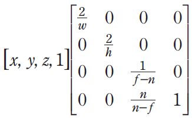
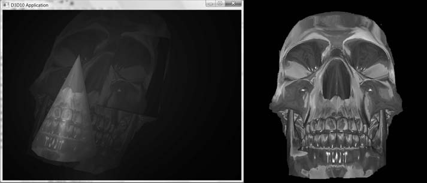
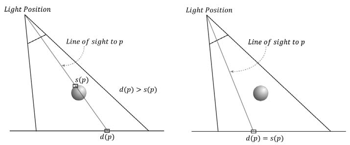
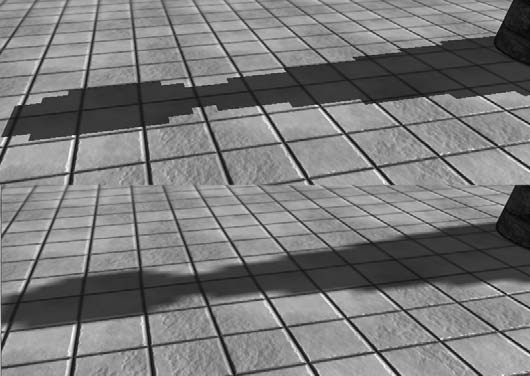
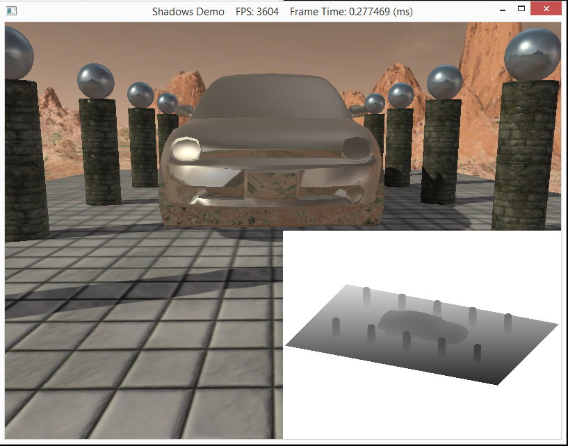

Lighting has given us the ability to take our 3 dimensional objects within the scene and take them from flat shapeless objects to ones that appear to have more dimension. Lightning also now allows us to utilize other techniques to add to our scenes. One of these techniques is shadow mapping. Adding shadows to our scenes helps give an indication of the location of lights and helps convey the location of objects in relation to others within a scene. For this lab, we will focus on the basic shadow mapping algorithm used to model shadows. 

0. Getting Started
==================

Download [CS470\_Lab14.zip](src/CS470_Lab14.zip), saving it into the **labs** directory.

Double-click on **CS470\_Lab14.zip** and extract the contents of the archive into a subdirectory called **CS470\_Lab14**

Navigate into the **CS470\_Lab14** directory and double-click on **CS470\_Lab14.sln**.

1. Overview
===========

Up to this point we have always rendered to the swap chain's back buffer. This doesn't always have to be the case. In order to create the illusion of shadows, we will render to another texture which we create. This texture can be updated at run time and once rendered, can be bound as a shader input and be mapped onto geometry.

Shadow mapping is rendering to texture the scene depth from the viewpoint of the light into a depth buffer called a **shadow map**. This shadow map will contain the depth values of all the visible pixels from the perspective of the light. To render the scene from the viewpoint of the light we need to define a light view matrix, transforming coordinates from world space to the space of the light and a light projection matrix. This describes the volume light emits through the world. This can be box light volume for parallel lights or frustum light volume for spotlights. Either is bounded by the projection matrix defined.

Once the shadow map is built, we render the scene from the perspective of the camera. With use of projective texturing we add shadows to our scene. We will look at all of this in more detail below.

2. Render to Texture
====================

As stated before, shadow mapping is rendering to texture the scene depth from the view of the light source. To do this, we implement a class called **ShadowMap**. This class encapsulates the resource views into two textures: a  textDesc, which is bound as the render target, and a depth map, which is bound as the depth/stencil buffer.

```cpp
ID3D11ShaderResourceView* DepthMapSRV();
D3D11_Texture2D_DESC textDesc;
```

When we build the depth map we want to bind the texture as a depth/stencil buffer and as a shader input. Add the following code to **ShadowMap.cpp**.

```cpp
//TODO: Set bind flags so texture is bound as a depth/stencil buffer and as a shader input
texDesc.BindFlags = D3D11_BIND_DEPTH_STENCIL | D3D11_BIND_SHADER_RESOURCE;
```

Due to our resource view using a different format than the depth/stencil view, we want to set the texture format as typeless. **DXGI\_FORMAT\_D32\_FLOAT** and **DXGI\_FORMAT\_R32\_FLOAT** respectively. The reason is the the format is dependent on the view.

Add the following code to **ShadowMap.cpp**.

```cpp
//TODO: Set format to typeless
texDesc.Format = DXGI_FORMAT_R24G8_TYPELESS;
```

Since we want to render to the texture for our shadow map rather than the back buffer, we need to change our render target as well as the viewport being switched from the camera to the lightsource. If the color map contains any values, it is cleared and the depth map is set to default. Add the following code to **ShadowMap.cpp**.

```cpp
//TODO: Set render target, viewport, and prepare maps
dc->RSSetViewports(1, &mViewport);

//Set null render target because we are only going to draw to depth buffer.
// Setting a null render target will disable color writes.
ID3D11RenderTargetView* renderTargets[1] = {0};
dc->OMSetRenderTargets(1, renderTargets, mDepthMapDSV);
dc->ClearDepthStencilView(mDepthMapDSV, D3D11_CLEAR_DEPTH, 1.0f, 0);
```

3. Projective Texturing
=======================

Orthographic Projections
------------------------

So far we have been rendering everything in a perspective projection. However, to properly emulate the volume that a parallel light emits into the world, we must switch to an orthographic projection when building the shadow map, where our perception of objects is not distorted by our position relative to them. For a spotlight, we will maintain a perspective projection when building the shadow map.

An orthographic projection is achieved with this matrix multiplication (see section 21.2 for the derivation):

> 

Projective Texture Coordinates
------------------------------

Projective texturing allows us to (wait for it) project a texture onto any surface we define. Although projective texturing has more straightforward uses, we will be using it to help us build the shadow map.

Projective Texturing - The skull picture (right) is a projected texture in the image below.

> 

In order to get a texture to look as though it has been projected onto something else, it is necessary to select the correct texture coordinates for every pixel of the surface that we are projecting that texture onto. These are called the projected texture coordinates, and the process is completed in two steps:

1.  Given a texture coordinate (u,v), project it into the 3D scene as point **p**, and then transform **p** into normalized device coordinates.

2.  Transform the point **p** that is in normalized device coordinates into texture coordinates.

To generate our projective Normalized tessellation factor, add this code to **BuildShadowMap.fx**'s Tessellation vertex shader:

```
float d = distance ( vout.PosW, gEyePosW );

// Normalized tessellation factor.
// The tessellation is 
//     0 if d >= gMinTessDistance and 
//     1 if d<= gMaxTessDistance.
float tess = saturate( ( gMinTessDistance - d ) / ( gMinTessDistance - gMaxTessDistance ) );

// Rescale [ 0 , 1 ] --> [gMinTessFactor, gMaxTessFactor ].
vout.TessFactor = gMinTessFactor + tess * ( gMaxTessFactor - gMinTessFactor );
```

and **PatchHS** function:

```cpp
// Average tess factors along edges, and pick an edge tess factor for 
// the interior tessellation.  It is important to do the tess factor
// calculation based on the edge properties so that edges shared by 
// more than one triangle will have the same tessellation factor.  
// Otherwise, gaps can appear.
pt.EdgeTess[0] = 0.5f*(patch[1].TessFactor + patch[2].TessFactor);
pt.EdgeTess[1] = 0.5f*(patch[2].TessFactor + patch[0].TessFactor);
pt.EdgeTess[2] = 0.5f*(patch[0].TessFactor + patch[1].TessFactor);
pt.InsideTess  = pt.EdgeTess[0];
```

4. Shadow Factor
================

The shadow factor is a number in the range of 0 to 1 that is added into the lighting equation. 0 indicates that a point is in shadow, 1 indicates it is not, and any number in between indicates it is partially in shadow.

Our lighting fuctions in **lighthelper.fx** have been updated to take a shadow factor parameter.

```
float CalcShadowFactor(SamplerComparisonState samShadow, Texture2D shadowMap, float4 shadowPosH);
```

In **lighthelper.fx**, modify the final calculation in **CalcShadowFactor()** to this:

```cpp
// Complete projection by doing division by w.
shadowPosH.xyz /= shadowPosH.w;
	
// Depth in NDC space.
float depth = shadowPosH.z;
// Texel size.
const float dx = SMAP_DX;
float percentLit = 0.0f;
const float2 offsets[9] = 
{
	float2(-dx,  -dx), float2(0.0f,  -dx), float2(dx,  -dx),
	float2(-dx, 0.0f), float2(0.0f, 0.0f), float2(dx, 0.0f),
	float2(-dx,  +dx), float2(0.0f,  +dx), float2(dx,  +dx)
};
[unroll]
for(int i = 0; i < 9; ++i)
{
	percentLit += shadowMap.SampleCmpLevelZero(samShadow, 
	shadowPosH.xy + offsets[i], depth).r;
}
return percentLit /= 9.0f;
```

5. The Shadow Map
=================

Now that we are within the perspective of the light, we want to render the scene in order to create our shadow map. From it, the depth buffer is extracted and saved as a texture. Add an effect file to your project called **BuildShadowMap.fx**. Once the file is created, add the following code:

```cpp
cbuffer cbPerFrame
{
	float3 gEyePosW;
	
	float gHeightScale;
	float gMaxTessDistance;
	float gMinTessDistance;
	float gMinTessFactor;
	float gMaxTessFactor;
};

cbuffer cbPerObject
{
	float4x4 gWorld;
	float4x4 gWorldInvTranspose;
	float4x4 gViewProj;
	float4x4 gWorldViewProj;
	float4x4 gTexTransform;
}; 

// Nonnumeric values cannot be added to a cbuffer.
Texture2D gDiffuseMap;
Texture2D gNormalMap;
 
SamplerState samLinear
{
	Filter = MIN_MAG_MIP_LINEAR;
	AddressU = Wrap;
	AddressV = Wrap;
};

struct VertexIn
{
	float3 PosL     : POSITION;
	float3 NormalL  : NORMAL;
	float2 Tex      : TEXCOORD;
};

struct VertexOut
{
	float4 PosH : SV_POSITION;
	float2 Tex  : TEXCOORD;
};
 
VertexOut VS(VertexIn vin)
{
	VertexOut vout;

	vout.PosH = mul(float4(vin.PosL, 1.0f), gWorldViewProj);
	vout.Tex  = mul(float4(vin.Tex, 0.0f, 1.0f), gTexTransform).xy;

	return vout;
}

struct TessVertexOut
{
	float3 PosW       : POSITION;
	float3 NormalW    : NORMAL;
	float2 Tex        : TEXCOORD;
	float  TessFactor : TESS;
};

// This is only used for alpha cut out geometry, so that shadows 
// show up correctly.  Geometry that does not need to sample a
// texture can use a NULL pixel shader for depth pass.
void PS(VertexOut pin)
{
	float4 diffuse = gDiffuseMap.Sample(samLinear, pin.Tex);

	// Don't write transparent pixels to the shadow map.
	clip(diffuse.a - 0.15f);
}

// This is only used for alpha cut out geometry, so that shadows 
// show up correctly.  Geometry that does not need to sample a
// texture can use a NULL pixel shader for depth pass.
void TessPS(DomainOut pin)
{
	float4 diffuse = gDiffuseMap.Sample(samLinear, pin.Tex);

	// Don't write transparent pixels to the shadow map.
	clip(diffuse.a - 0.15f);
}
TessVertexOut TessVS(VertexIn vin)
{
TessVertexOut vout;

vout.PosW     = mul(float4(vin.PosL, 1.0f), gWorld).xyz;
vout.NormalW  = mul(vin.NormalL, (float3x3)gWorldInvTranspose);
vout.Tex      = mul(float4(vin.Tex, 0.0f, 1.0f), gTexTransform).xy;
	
float d = distance(vout.PosW, gEyePosW);

// Normalized tessellation factor. 
// The tessellation is 
//   0 if d >= gMinTessDistance and
//   1 if d <= gMaxTessDistance.  
float tess = saturate( (gMinTessDistance - d) / (gMinTessDistance - gMaxTessDistance) );
// Rescale [0,1] --> [gMinTessFactor, gMaxTessFactor].
vout.TessFactor = gMinTessFactor + tess*(gMaxTessFactor-gMinTessFactor);

	return vout;
}

technique11 BuildShadowMapTech
{
    pass P0
    {
        SetVertexShader( CompileShader( vs_5_0, VS() ) );
        SetGeometryShader( NULL );
        SetPixelShader( NULL );
		SetRasterizerState(Depth);
    }
}
technique11 BuildShadowMapAlphaClipTech
{
    pass P0
    {
        SetVertexShader( CompileShader( vs_5_0, VS() ) );
        SetGeometryShader( NULL );
        SetPixelShader( CompileShader( ps_5_0, PS() ) );
    }
}
technique11 TessBuildShadowMapTech
{
    pass P0
    {
        SetVertexShader( CompileShader( vs_5_0, TessVS() ) );
		SetHullShader( CompileShader( hs_5_0, HS() ) );
        SetDomainShader( CompileShader( ds_5_0, DS() ) );
        SetGeometryShader( NULL );
        SetPixelShader( NULL );

		SetRasterizerState(Depth);
    }
}

technique11 TessBuildShadowMapAlphaClipTech
{
    pass P0
    {
        SetVertexShader( CompileShader( vs_5_0, TessVS() ) );
		SetHullShader( CompileShader( hs_5_0, HS() ) );
        SetDomainShader( CompileShader( ds_5_0, DS() ) );
        SetGeometryShader( NULL );
        SetPixelShader( CompileShader( ps_5_0, TessPS() ) );
    }
}
```

In order to render from the perspective of the light, we only need a position element and texture coordinates element. Another thing you will notice is that the pixel shader doesn't return a value. The reason is that the pixel shader is used to clip pixel fragments with zero or low alpha levels. We just want to output depth values. all lighting and texture calculations are also disabled in order to save drawing time. After creating our shadow map, we need to return to the perspective of the camera. Add the following code to **Shadow Map Demo.cpp** in the **DrawScene()** method:

```cpp
//
// Restore the back and depth buffer to the OM stage.
//
ID3D11RenderTargetView* renderTargets[1] = {mRenderTargetView};
md3dImmediateContext->OMSetRenderTargets(1, renderTargets, mDepthStencilView);
md3dImmediateContext->RSSetViewports(1, &mScreenViewport);

md3dImmediateContext->ClearRenderTargetView(mRenderTargetView, reinterpret_cast<const float*>(&Colors::Silver));
md3dImmediateContext->ClearDepthStencilView(mDepthStencilView, D3D11_CLEAR_DEPTH|D3D11_CLEAR_STENCIL, 1.0f, 0);
```
and restore to shadowmap to the default values at the end of **DrawScene()** so that the skyfx will not change the effects file.

```cpp
// restore default states, as the SkyFX changes them in the effect file.
md3dImmediateContext->RSSetState(0);
md3dImmediateContext->OMSetDepthStencilState(0, 0);

// Unbind shadow map as a shader input because we are going to render to it next frame.
// The shadow might might be at any slot, so clear all slots.
ID3D11ShaderResourceView* nullSRV[16] = { 0 };
md3dImmediateContext->PSSetShaderResources(0, 16, nullSRV);
```

The Shadow Map Test
-------------------

In order to give the effect of shadows, once back in the camera's perspective, the coordinates of the object are taken as seen from the light and used to compute d(p) and s(p) for each pixel. d(p) is found by transforming the point to NDC(Normalized Device Coordinates) space. The x- and y-coordinates correspond to a point's location in the depth texture and the z-coordinate gives the normalized depth value of the point from the light source. s(p) is found by projecting the shadow map onto the scene through the light's view volume. If the z value is greater than the value stored in the depth map then it is said to of failed the Shadow Map Test and the pixel is in shadow. 

> 

Add the following code to **BuildShadowMap.fx**. It performs our shadow map test. This code is just to start you off with performing smoother shadow. 

```cpp
#include "LightHelper.fx"

cbuffer cbPerFrame
{
	DirectionalLight gDirLights[3];
	float3 gEyePosW;

	float gFogStart;
	float gFogRange;
	float gFogColor;
};

cbuffer cbPerObject
{
	float4x4 gWorld;
	float4x4 gWorldInvTranspose;
	float4x4 gWorldViewProj;
	float4x4 gTexTransform;
	float4x4 gShadowTransform;
	Material gMaterial;
}; 

// Nonnumeric values cannot be added to a cbuffer.
Texture2D gDiffuseMap;
Texture2D gNormalMap;
Texture2D gShadowMap;
TextureCube gCubeMap;
 
SamplerState samLinear
{
	Filter = MIN_MAG_MIP_LINEAR;
	AddressU = Wrap;
	AddressV = Wrap;
};

SamplerComparisonState samShadow{
	Filter = COMPARISON_MIN_MAG_LINEAR_MIP_POINT;
	AddressU = BORDER;
	AddressV = BORDER;
	AddressW = BORDER;
	BorderColor = float4(0.0f, 0.0f, 0.0f, 0.0f);

	ComparisonFunc = LESS_EQUAL;
};

struct VertexIn
{
	float3 PosL     : POSITION;
	float3 NormalL  : NORMAL;
	float2 Tex      : TEXCOORD;
	float3 TangentL : TANGENT;
};

struct VertexOut
{
	float4 PosH : SV_POSITION;
	float3 PosW : POSITION;
	float3 NormalW : NORMAL;
	float3 TangentW : TANGENT;
	float2 Tex  : TEXCOORD0;
	float4 ShadowPosH : TEXCOORD1;
};
 
VertexOut VS(VertexIn vin)
{
	VertexOut vout;

	// Transform to world space space.
	vout.PosW = mul(float4(vin.PosL, 1.0f), gWorld).xyz;
	vout.NormalW = mul(vin.NormalL, (float3x3)gWorldInvTranspose);
	vout.TangentW = mul(vin.TangentL, (float3x3)gWorld);

	// Transform to homogeneous clip space
	vout.PosH = mul(float4(vin.PosL, 1.0f), gWorldViewProj);

	// Output vertex attributes for interpolation across triangle. 
	vout.Tex  = mul(float4(vin.Tex, 0.0f, 1.0f), gTexTransform).xy;

	// Generate Projective tex-coords to project shadow map onto scene.
	vout.ShadowPosH = mul(float4(vin.PosL, 1.0f), gShadowTransform);

	return vout;
}
float4 PS(VertexOut pin,uniform int gLightCount,uniform bool gUseTexure,uniform bool gAlphaClip,uniform bool gFogEnabled,uniform bool gReflectionEnabled) : SV_Target
{
	// Interpolating normal can unnormalize it, so normalize it.
	pin.NormalW = normalize(pin.NormalW);
	// The toEye vector is used in lighting.
	float3 toEye = gEyePosW - pin.PosW;
		// Cache the distance to the eye from this surface point.
		float distToEye = length(toEye);
	// Normalize.
	toEye /= distToEye;
	// Default to multiplicative identity.
	float4 texColor = float4(1, 1, 1, 1);
	if (gUseTexure)
	{
		// Sample texture.
		texColor = gDiffuseMap.Sample(samLinear, pin.Tex);
		if(gAlphaClip)
		{
			// Discard pixel if texture alpha < 0.1. Note that we
			// do this test as soon as possible so that we can
			// potentially exit the shader early, thereby skipping
			// the rest of the shader code.
			clip(texColor.a - 0.1f);
		}
	}
	//
	// Normal mapping
	//
	float3 normalMapSample = gNormalMap.Sample(samLinear, pin.Tex).rgb;
	float3 bumpedNormalW = NormalSampleToWorldSpace(
	normalMapSample, pin.NormalW, pin.TangentW);
	//
	// Lighting.
	//
	float4 litColor = texColor;
	if (gLightCount > 0)
	{
		// Start with a sum of zero.
		float4 ambient = float4(0.0f, 0.0f, 0.0f, 0.0f);
			float4 diffuse = float4(0.0f, 0.0f, 0.0f, 0.0f);
			float4 spec = float4(0.0f, 0.0f, 0.0f, 0.0f);
			// Only the first light casts a shadow.
			float3 shadow = float3(1.0f, 1.0f, 1.0f);
			shadow[0] = CalcShadowFactor(samShadow, gShadowMap, pin.ShadowPosH);
		// Sum the light contribution from each light source.
		[unroll]
		for (int i = 0; i < gLightCount; ++i)
		{
			float4 A, D, S;
			ComputeDirectionalLight(gMaterial, gDirLights[i],
				bumpedNormalW, toEye, A, D, S);
			ambient += A;
			diffuse += shadow[i] * D;
			spec += shadow[i] * S;
		}
		litColor = texColor*(ambient + diffuse) + spec;
		if (gReflectionEnabled)
		{
			float3 incident = -toEye;
			float3 reflectionVector = reflect(incident, bumpedNormalW);
			float4 reflectionColor = gCubeMap.Sample(
				samLinear, reflectionVector);
			litColor += gMaterial.Reflect*reflectionColor;
		}
	}
	//
	// Fogging
	//
	if (gFogEnabled)
	{
		float fogLerp = saturate((distToEye - gFogStart) / gFogRange);
		// Blend the fog color and the lit color.
		litColor = lerp(litColor, gFogColor, fogLerp);
	}
	// Common to take alpha from diffuse material and texture.
	litColor.a = gMaterial.Diffuse.a * texColor.a;
	return litColor;
}
```

This way we can have pixels partially in shadow, and the difference is readily apparent:

> 

6. Compiling and running the program
====================================

Once you have completed typing in the code, you can build and run the program in one of two ways:

-   Click the small green arrow in the middle of the top toolbar
-   Hit **F5** (or **Ctrl-F5**)

The output should look similar to below

> 

To quit the program simply close the window.


